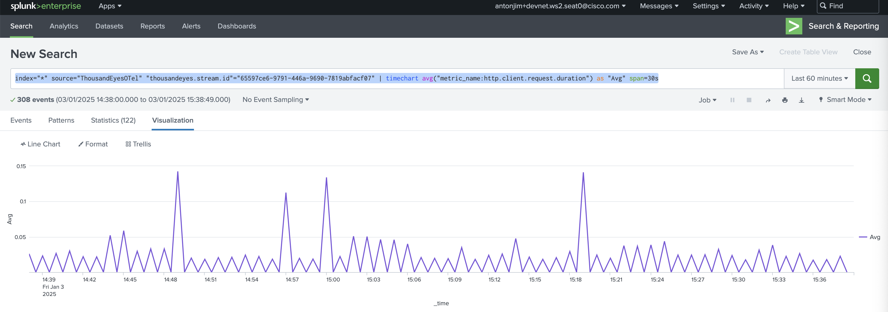
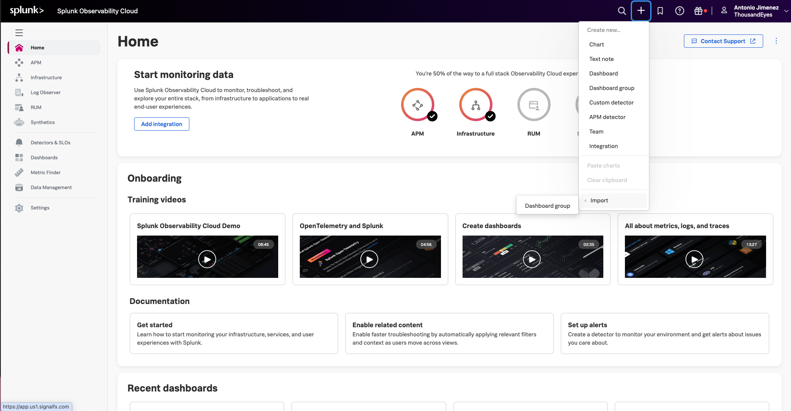

# DEVWKS-2656 Stream ThousandEyes Data to Splunk Using OpenTelemetry


# Introduction

Welcome to the workshop for streaming ThousandEyes data to Splunk using OpenTelemetry.
This workshop will guide you through setting up integrations between ThousandEyes and Splunk, enabling you to visualize and analyze network monitoring data effectively.

## Note:

Each attendee has a unique login:
 - User: `antonjim+devnet.ws2.<seat>@cisco.com` 
   - E.g. `antonjim+devnet.ws2.seat1@cisco.com`. Correspond with your seat.
 - Password: `C1sco12345!`

# Step-by-Step Guide

## Step 1. Login ThousandEyes

- Navigate to [ThousandEyes Login](https://app.thousandeyes.com/login)
  -  
     - Email: `antonjim+devnet.ws2.<seat>@cisco.com` (e.g. `antonjim+devnet.ws2.seat1@cisco.com`)
     - Password: `C1sco12345!`
  
## Step 2. Obtain ThousandEyes OAuth Bearer token

Each API request to ThousandEyes should be authenticated using OAuth Bearer Token.

To obtain it follow the following steps:
- After logging in, navigate to `Account Settings` -> `Users and Roles` 
- Click `Create` next to `OAuth Bearer Token` on `User API Tokens` 
- ThousandEyes will generate new OAuth Bearer Token for you and show it in a new popup window 
- Click `Copy` and
- Save the token into the placeholder `<ThousandEyes_token>` of [tokens_and_ids.md file](<tokens_and_ids.md>). This token will be used for all API requests.

> [!WARNING]
> The OAuth Token is shown only once. If lost, you need to revoke and create a new one.

## Step 3. Create ThousandEyes HTTP Server test

For ThousandEyes to be able to stream data to Splunk, the data first needs to be collected by ThousandEyes. To achieve this, we
need to create a ThousandEyes test.
Refer to [ThousandEyes documentation](https://docs.thousandeyes.com/product-documentation/tests) for test creation.

We are going to create an `HTTP Server` test that validates the availability of `www.google.com`.
Full description of the API request is available at [ThousandEyes API Reference](https://developer.cisco.com/docs/thousandeyes/create-http-server-test).

- Use the following API request to create a test:
```
curl --location 'https://api.thousandeyes.com/v7/tests/http-server' \
--header 'Content-Type: application/json' \
--header 'Authorization: Bearer <ThousandEyes_token>' \
--data '{
    "interval": 60,
    "agents": [{"agentId": 7}],
    "testName": "DEVWKS-2656",
    "url": "www.google.com"
}'
```

> [!NOTE]
> You can use other `agentId` using [ThousandEyes API List Agents](https://developer.cisco.com/docs/thousandeyes/list-cloud-and-enterprise-agents).

- Save the `testId` from the response into the placeholder `<ThousandEyes_test_id>` of [tokens_and_ids.md file](<tokens_and_ids.md>)
```
{
    "testId": "281474976818273",
    ...
}
```

## Step 4. Create Splunk Enterprise integration

### Step 4.a. Login into Splunk Enterprise

- Navigate to [Splunk Enterprise](https://splunk.pseudoco.net)
  -  
  - Username: `antonjim+devnet.ws2.<seat>@cisco.com`  (e.g. `antonjim+devnet.ws2.seat1@cisco.com`)
  - Password: `C1sco12345!`
- Welcome page 

### Step 4.b. Get Splunk HEC token

- Navigate to `Settings` -> `Data Inputs`  
- Open `HTTP Event Collector`  
- There you can find a pre-provisioned token called `Default` which you can use. Copy `Token Value`

- Save it into the placeholder `<Splunk_Enterprise_HEC_token>` of [tokens_and_ids.md file](<tokens_and_ids.md>)

### Step 4.c. Create Streaming integration on ThousandEyes for Splunk Enterprise

- Create a streaming integration for Splunk Enterprise. Check the [ThousandEyes API documentation](https://developer.cisco.com/docs/thousandeyes/create-data-stream).

```
curl --location 'https://api.thousandeyes.com/v7/stream' \
--header 'Authorization: Bearer <ThousandEyes_token>' \
--header 'Content-Type: application/json' \
--data '{
    "type": "splunk-hec",
    "testMatch": [
        {
            "id": "<ThousandEyes_test_id>",
            "domain": "cea"
        }
    ],
    "exporterConfig": {
        "splunkHec":{
            "token": "<Splunk_Enterprise_HEC_token>"
        }
    },
    "endpointType": "http",
    "streamEndpointUrl": "https://splunk.pseudoco.net:8088/services/collector/event"
}'

```
> [!NOTE]
> Copy the `<ThousandEyes_test_id>` from [tokens_and_ids.md file](<tokens_and_ids.md>)
> 
> Copy the `<Splunk_Enterprise_HEC_token>` from [tokens_and_ids.md file](<tokens_and_ids.md>)

- Save the `id` from the response into the placeholder `<Splunk_Enterprise_stream_id>` of [tokens_and_ids.md file](<tokens_and_ids.md>)
```
{
    "id": "151a3417-6d4b-4db7-a8d9-557a62252e4b",
    ...
}
```

## Step 5. Create Splunk Observability Cloud integration

### Step 5.a. Login into Splunk Observability Cloud

- Navigate to [Splunk Observability Cloud](https://app.eu1.signalfx.com/#/signin)
  - 
  - Email: `antonjim+devnet.ws2.<seat>@cisco.com` 
    - (e.g. `antonjim+devnet.ws2.seat1@cisco.com`)
  - Password: `C1sco12345!`

### Step 5.b. Get Splunk Observability Cloud Access Tokens

- Navigate to `Settings` -> `Access Tokens`
- There you can find a pre-provisioned token called `Default` which you can use. Copy `Token Value` 
- Save it into the placeholder `<Splunk_Observability_access_token>` of [tokens_and_ids.md file](<tokens_and_ids.md>)

### Step 5.c. Create Streaming integration on ThousandEyes for Splunk Observability Cloud

- Create a streaming integration for Splunk Observability Cloud. Check the [ThousandEyes API documentation](https://developer.cisco.com/docs/thousandeyes/create-data-stream).

```
curl --location 'https://api.thousandeyes.com/v7/stream' \
--header 'Authorization: Bearer <ThousandEyes_token>' \
--header 'X-ThousandEyes-Partner-Id: test' \
--header 'Content-Type: application/json' \
--data '{
    "type": "openTelemetry",
    "testMatch": [
        {
            "id": "<testId>",
            "domain": "cea"
        }
    ],
    "endpointType": "http",
    "streamEndpointUrl": "https://ingest.eu1.signalfx.com:443/v2/datapoint/otlp",
    "customHeaders": {
        "X-SF-Token": "<Splunk-Observability-access-token>",
        "Content-Type": "application/x-protobuf"
    }
}'
```

> [!NOTE]
> Copy the `<ThousandEyes_test_id>` from [tokens_and_ids.md file](<tokens_and_ids.md>)
> 
> Copy the `<Splunk_Observability_access_token>` from [tokens_and_ids.md file](<tokens_and_ids.md>)


## Step 6. Visualize ThousandEyes telemetry data in Splunk Enterprise

- Open [Splunk Enterprise](https://splunk.pseudoco.net)
- Navigate to `Search & Reporting` 
- Search by `index="*" source="ThousandEyesOTel"`  
- Create a chart by searching the following query and click on `Visualization`
```
index="*" source="ThousandEyesOTel" "thousandeyes.stream.id"="<Splunk_Enterprise_stream_id>" | timechart avg("metric_name:http.client.request.duration") as "Avg" span=30s
```


> [!NOTE]
> Copy the `Splunk_Enterprise_stream_id` from [tokens_and_ids.md file](<tokens_and_ids.md>)

## Step 7. Visualize ThousandEyes telemetry data in Splunk Observability Cloud

- Open [Splunk Observability Cloud](https://app.eu1.signalfx.com/#/signin)
- Navigate to `+` -> `Import` -> `Dashboard Group` 
- Import [dashboard file](<dashboards/ThousandEyes Network monitoring.json>)
- Visualize the data

