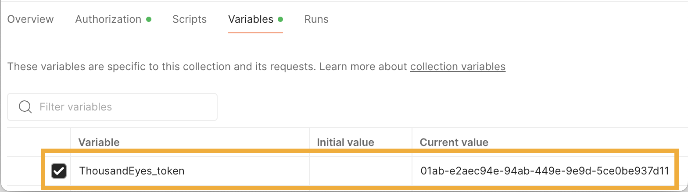
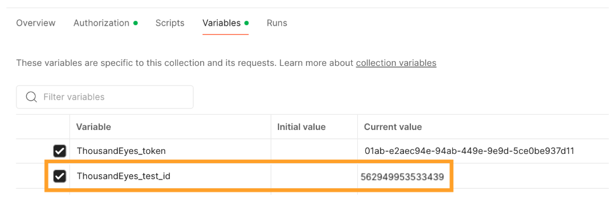
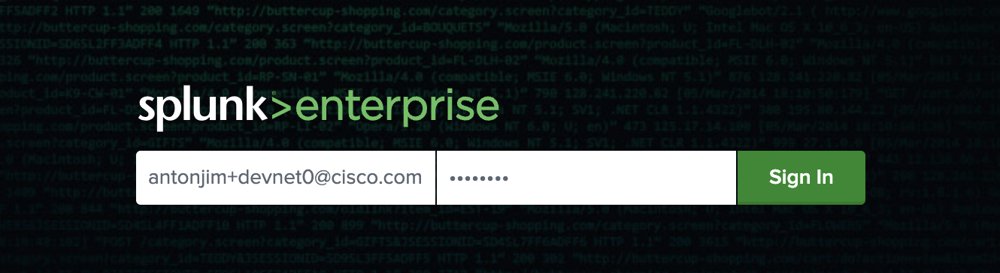
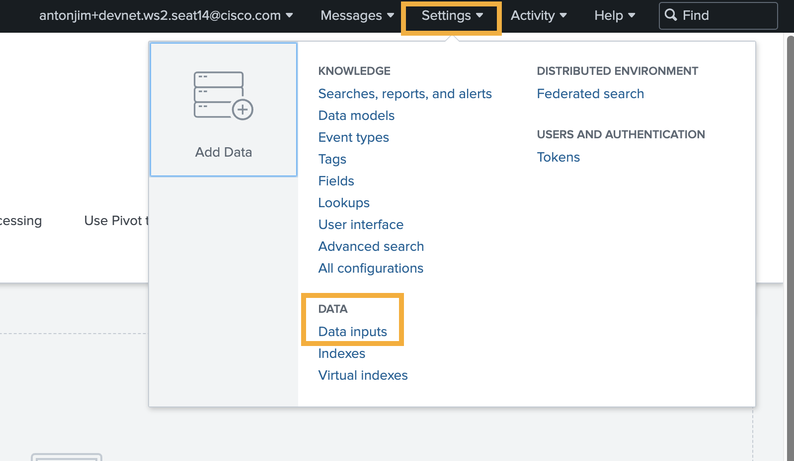
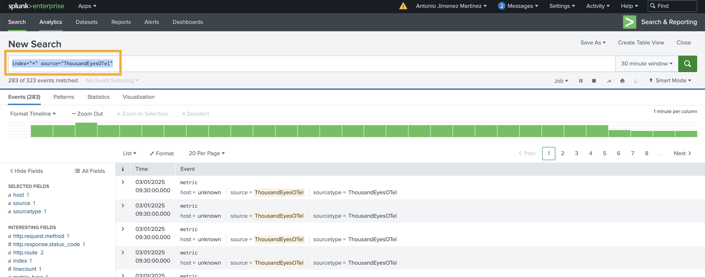
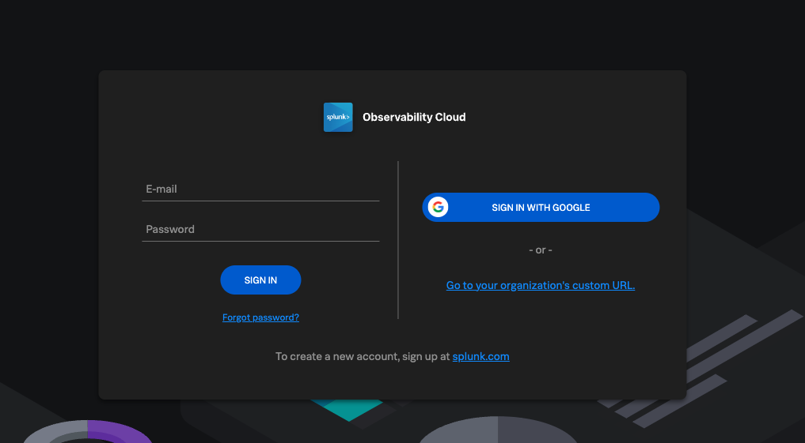
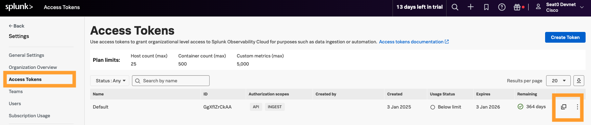

# DEVWKS-2656 Stream ThousandEyes Data to Splunk Using OpenTelemetry

# Table of Contents
- [DEVWKS-2656 Stream ThousandEyes Data to Splunk Using OpenTelemetry](#devwks-2656-stream-thousandeyes-data-to-splunk-using-opentelemetry)
- [Table of Contents](#table-of-contents)
- [Introduction](#introduction)
  - [Note](#note)
- [Step-by-Step Guide](#step-by-step-guide)
  - [Step 1. Postman](#step-1-postman)
    - [Step 1.a. Login Postman](#step-1a-login-postman)
    - [Step 1.b. Verify Postman collection `DEVWKS-2656`](#step-1b-verify-postman-collection-devwks-2656)
  - [Step 2. Login ThousandEyes](#step-2-login-thousandeyes)
  - [Step 3. Obtain ThousandEyes OAuth Bearer token](#step-3-obtain-thousandeyes-oauth-bearer-token)
  - [Step 4. Create ThousandEyes HTTP Server test](#step-4-create-thousandeyes-http-server-test)
  - [Step 5. Create Splunk Enterprise integration](#step-5-create-splunk-enterprise-integration)
    - [Step 5.a. Login into Splunk Enterprise](#step-5a-login-into-splunk-enterprise)
    - [Step 5.b. Get Splunk HEC token](#step-5b-get-splunk-hec-token)
    - [Step 5.c. Create Streaming integration on ThousandEyes for Splunk Enterprise](#step-5c-create-streaming-integration-on-thousandeyes-for-splunk-enterprise)
  - [Step 6. Visualize ThousandEyes telemetry data in Splunk Enterprise](#step-6-visualize-thousandeyes-telemetry-data-in-splunk-enterprise)
  - [Step 7. Create Splunk Observability Cloud integration](#step-7-create-splunk-observability-cloud-integration)
    - [Step 7.a. Login into Splunk Observability Cloud](#step-7a-login-into-splunk-observability-cloud)
    - [Step 7.b. Get Splunk Observability Cloud Access Tokens](#step-7b-get-splunk-observability-cloud-access-tokens)
    - [Step 7.c. Create Streaming integration on ThousandEyes for Splunk Observability Cloud](#step-7c-create-streaming-integration-on-thousandeyes-for-splunk-observability-cloud)
  - [Step 8. Visualize ThousandEyes telemetry data in Splunk Observability Cloud](#step-8-visualize-thousandeyes-telemetry-data-in-splunk-observability-cloud)

# Introduction

Welcome to the workshop for streaming ThousandEyes data to Splunk using OpenTelemetry.
This workshop will guide you through setting up integrations between ThousandEyes and Splunk, enabling you to visualize and analyze network monitoring data effectively.

## Note

Each attendee has a unique login:
 - User: `antonjim+devnet.ws2.<seat>@cisco.com` 
   - E.g. `antonjim+devnet.ws2.seat1@cisco.com`. Correspond with your seat.
 - Password: `C1sco12345!`

# Step-by-Step Guide

## Step 1. Postman

### Step 1.a. Login Postman

> [!NOTE]
> You may be already singed in. Then, you can skip this step.

- Open Postman application
  -  Sign in 
     - Email: `antonjim+devnet.ws2.<seat>@cisco.com` (e.g. `antonjim+devnet.ws2.seat1@cisco.com`)
     - Password: `C1sco12345!`
    

### Step 1.b. Verify Postman collection `DEVWKS-2656` 

- Navigate to `Workspaces` -> `My Workspace` 
- Identify the collection `DEVWKS-2656`
  - Confirm the requests and variables are there. We will use them during the session.
  -  

## Step 2. Login ThousandEyes

- Navigate to [ThousandEyes Login](https://app.thousandeyes.com/login){:target="_blank"}
  -  
     - Email: `antonjim+devnet.ws2.<seat>@cisco.com` (e.g. `antonjim+devnet.ws2.seat1@cisco.com`)
     - Password: `C1sco12345!`
  
## Step 3. Obtain ThousandEyes OAuth Bearer token

Each API request to ThousandEyes should be authenticated using OAuth Bearer Token.

To obtain it follow the following steps:
- After logging in, navigate to `Account Settings` -> `Users and Roles` 
- Click `Create` next to `OAuth Bearer Token` on `User API Tokens` 
- ThousandEyes will generate new OAuth Bearer Token for you and show it in a new popup window 
- Click `Copy` and
- Save the token into the variable `ThousandEyes_token` in Postman 

> [!WARNING]
> The OAuth Token is shown only once. If lost, you need to revoke and create a new one.

## Step 4. Create ThousandEyes HTTP Server test

For ThousandEyes to be able to stream data to Splunk, the data first needs to be collected by ThousandEyes. To achieve this, we
need to create a ThousandEyes test.
Refer to [ThousandEyes documentation](https://docs.thousandeyes.com/product-documentation/tests){:target="_blank"} for test creation.

We are going to create an `HTTP Server` test that validates the availability of `www.google.com`.
Full description of the API request is available at [ThousandEyes API Reference](https://developer.cisco.com/docs/thousandeyes/create-http-server-test){:target="_blank"}.

- Use the following Postman request to create the HTTP test 

> [!NOTE]
> You can use other `agentId` using [ThousandEyes API List Agents](https://developer.cisco.com/docs/thousandeyes/list-cloud-and-enterprise-agents){:target="_blank"}, [more info](<getAgentId.md>).

- Save the `testId` from the response into the variable `ThousandEyes_test_id` in Postman 

## Step 5. Create Splunk Enterprise integration

### Step 5.a. Login into Splunk Enterprise

- Navigate to [Splunk Enterprise](https://splunk.pseudoco.net){:target="_blank"}
  -  
  - Username: `antonjim+devnet.ws2.<seat>@cisco.com`  (e.g. `antonjim+devnet.ws2.seat1@cisco.com`)
  - Password: `C1sco12345!`
- Welcome page 

### Step 5.b. Get Splunk HEC token

- Navigate to `Settings` -> `Data Inputs`  
- Open `HTTP Event Collector`  
- There you can find a pre-provisioned token called `Default` which you can use. Copy `Token Value`

- Save the `HEC token` into the variable `Splunk_Enterprise_HEC_token` in Postman 

### Step 5.c. Create Streaming integration on ThousandEyes for Splunk Enterprise

- Create a stream integration for Splunk Enterprise. Check the [ThousandEyes API documentation](https://developer.cisco.com/docs/thousandeyes/create-data-stream){:target="_blank"}.
- Use the following Postman request to create the stream 

## Step 6. Visualize ThousandEyes telemetry data in Splunk Enterprise

- Open [Splunk Enterprise](https://splunk.pseudoco.net){:target="_blank"}
- Navigate to `Search & Reporting` 
- Search by `index="*" source="ThousandEyesOTel"`  
- Navigate to `Dashboards` 
- Select `DEVWKS-2656` 
- Visualize the data

## Step 7. Create Splunk Observability Cloud integration

### Step 7.a. Login into Splunk Observability Cloud

- Navigate to [Splunk Observability Cloud](https://app.eu1.signalfx.com/#/signin){:target="_blank"}
  - 
  - Email: `antonjim+devnet.ws2.<seat>@cisco.com` 
    - (e.g. `antonjim+devnet.ws2.seat1@cisco.com`)
  - Password: `C1sco12345!`

### Step 7.b. Get Splunk Observability Cloud Access Tokens

- Navigate to `Settings` -> `Access Tokens`
- There you can find a pre-provisioned token called `Default` which you can use. Copy `Token Value` 
- Save the `token` into the variable `Splunk_Observability_access_token` in Postman  

### Step 7.c. Create Streaming integration on ThousandEyes for Splunk Observability Cloud

- Create a streaming integration for Splunk Observability Cloud. Check the [ThousandEyes API documentation](https://developer.cisco.com/docs/thousandeyes/create-data-stream){:target="_blank"}.
- Use the following Postman request to create the stream 

## Step 8. Visualize ThousandEyes telemetry data in Splunk Observability Cloud

- Open [Splunk Observability Cloud](https://app.eu1.signalfx.com/#/signin){:target="_blank"}
- Navigate to `Dashboard` 
- In `Custom dashboard groups`, expand `DEVWKS-2656` and select `Application` 
- Visualize the data

