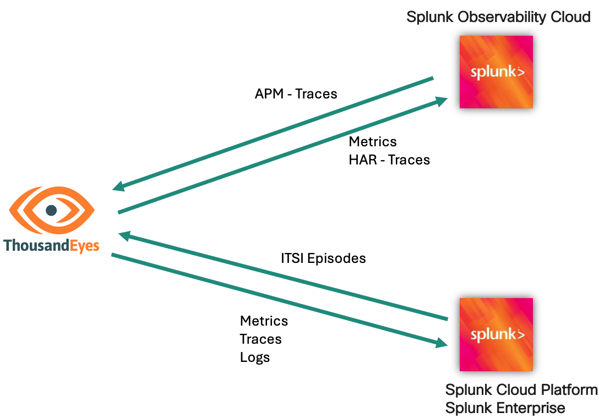

# ThousandEyes - Splunk Integrations Workshop

Welcome to the workshop for the ThousandEyes-Splunk integration!

During this session you will learn about: 

- [**Visualizing the service map using distributed tracing in ThousandEyes**](service_map/basic/getting_started.md)
- [**Streaming ThousandEyes data to Splunk Observability Cloud**](splunk_observability/login_splunk_observability.md)
- [**Streaming ThousandEyes data to Splunk Cloud Platform or Splunk Enterprise**](splunk_core/login_splunk_cloud_enterprise.md)
- [**Exploring the advanced capabilities of the Cisco ThousandEyes App for Splunk**](thousandeyes_splunk_app/getting_started.md)

## Prerequisites

To prepare for this workshop:
- Have an account in the following platforms:
    - Postman
    - ThousandEyes 
    - Splunk Observability Cloud
    - Splunk Cloud Platform or Splunk Enterprise (free trial is not valid due to the [issue](https://ideas.splunk.com/ideas/PLECID-I-816))
- Go through the [**Getting Started**](getting_started/access_postman.md) before starting the different sections of the workshop

## Other integrations

- [Stream ThousandEyes alerts to Splunk Cloud Platform or Splunk Enterprise](https://docs.thousandeyes.com/product-documentation/integration-guides/custom-webhook-examples/splunk-alert-notifs)