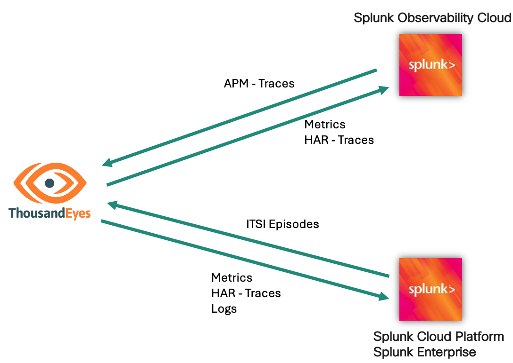

# ThousandEyes - Splunk Integrations Workshop

Welcome to the workshop for ThousandEyes and Splunk integration

During the session you will learn about: 

- [**Streaming ThousandEyes data to Splunk Observability Cloud**](splunk_observability/login_splunk_observability.md)
- [**Streaming ThousandEyes data to Splunk Cloud Platform**](splunk_core/login_splunk_cloud_enterprise.md)
- [**Explore the advanced capabilities of the Cisco ThousandEyes App for Splunk**](thousandeyes_splunk_app/getting_started.md)
- [**Visualize the service map using distributed tracing in ThousandEyes**](distributed_tracing_service_map/basic/getting_started.md)

## Prerequisites

- Have an account in the following platforms:
    - Postman
    - ThousandEyes 
    - Splunk Observability Cloud
    - Splunk Cloud Platform or Splunk Enterprise (free trial is not valid due to the [issue](https://ideas.splunk.com/ideas/PLECID-I-816))
- Go through the [**Getting Started**](getting_started/access_postman.md) before starting the different sections of the workshop
  
## Roadmap integration

 - Bidirectional ITSI: [Recording](https://demo.thousandeyes.com/player/?demoId=e0118145-9e9f-4835-b29b-c69cf00442fa&showGuide=true&showGuidesToolbar=true&showHotspots=true)
 - ThousandEyes & Splunk RUM: [Recording](https://app.vidcast.io/share/f3b211aa-2c73-402c-a8ec-dd5b0703f113)

## Other integrations

- [Stream ThousandEyes alerts to Splunk Cloud Platform or Splunk Enterprise](https://docs.thousandeyes.com/product-documentation/integration-guides/custom-webhook-examples/splunk-alert-notifs)