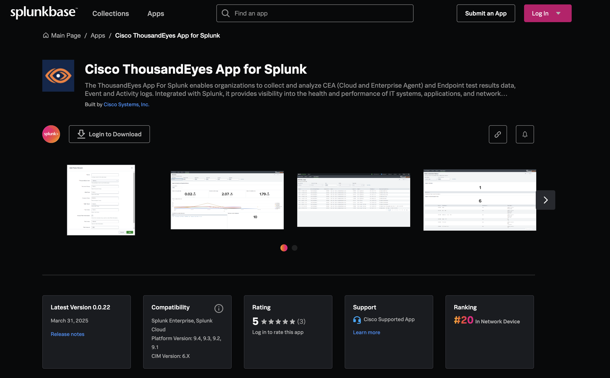
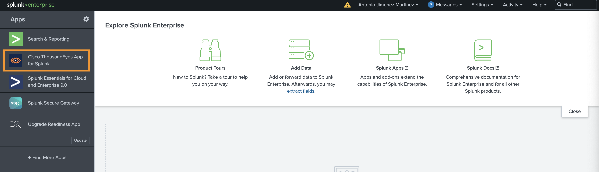
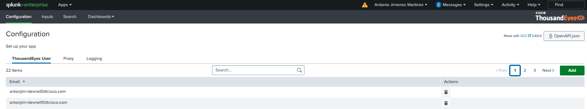
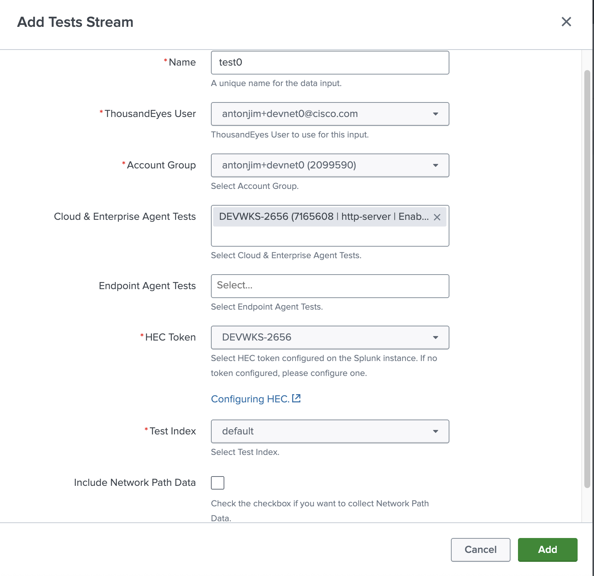
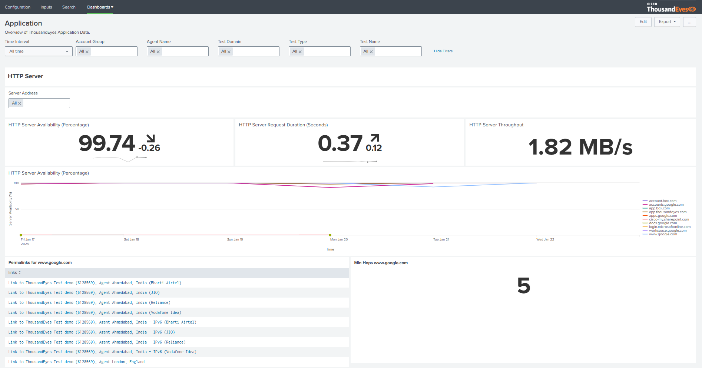
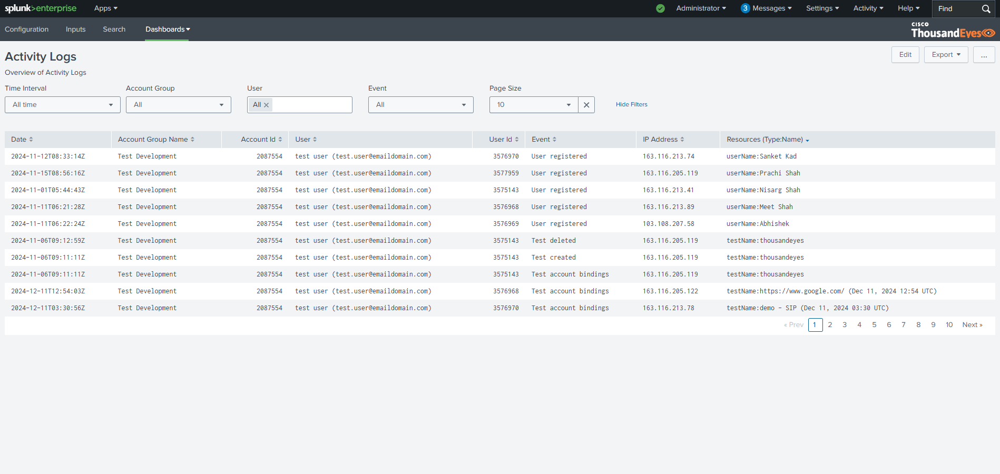

# Cisco ThousandEyes App for Splunk

The [Cisco ThousandEyes App for Splunk](https://splunkbase.splunk.com/app/7719) enables collectos and analyze:

- CEA (Cloud and Enterprise Agent) and Endpoint test results data
- Event
- Activity logs

## Navigate to Cisco ThousandEyes App for Splunk 

- Once we are logged into Splunk Enterprise 
- Navigate to `Cisco ThousandEyes App for Splunk`

- In the app, you will find out: `configuration`, `inputs`, `search` and `dashboards`. Check the [ThousandEyes documentation](https://docs.thousandeyes.com/product-documentation/integration-guides/custom-built-integrations/splunk-app)

## Create stream test input

- In `inputs` section
- Click `Create New Input`, select `Tests Stream`
- Fill the form:
    - Name: unique name, you can use `test_<seat>`. For example `test_1`
    - ThousandEyes User: select you user
    - Account Group: selec your account
    - Cloud & Enterprise Agent Tests: select your HTTP test
    - HEC Token: select `DEVWKS-2656`
    - Test Index: select `default`

## Network and Application dashboards

- In the `dashboards` section, select `Network` 

- In the `dashboards` section, select `Application`

## Create activity log input

- In `inputs` section
- Click `Create New Input`, select `Activity`
- Fill the form:
    - Name: unique name, you can use `activity_<seat>`. For example `activity_1`
    - ThousandEyes User: select you user
    - Account Group: selec your account
    - Index: select `default`

## Activity logs dashboards

- In the `dashboards` section, select `Activity Logs` 

