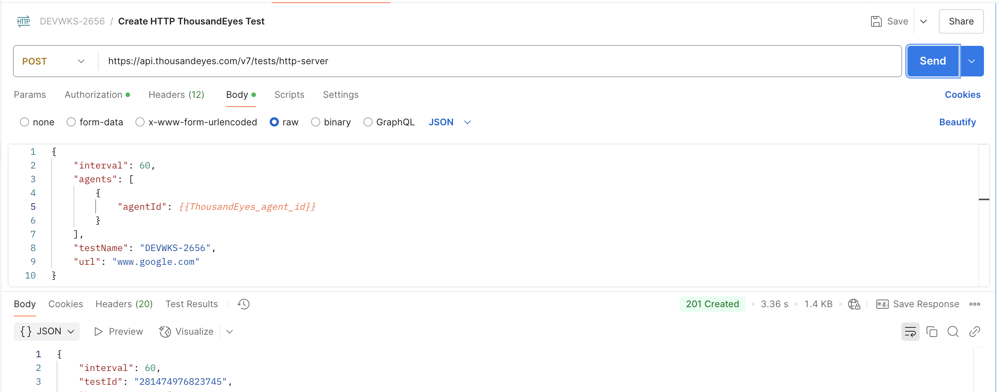

# Step 2. Create ThousandEyes HTTP Server test

For ThousandEyes to be able to stream data to Splunk, the data first needs to be collected by ThousandEyes. To achieve this, we
need to create a ThousandEyes test.
Refer to [ThousandEyes documentation](https://docs.thousandeyes.com/product-documentation/tests) for test creation.

We are going to create an `HTTP Server` test that validates the availability of `www.google.com`.
Full description of the API request is available at [ThousandEyes API Reference](https://developer.cisco.com/docs/thousandeyes/create-http-server-test).

- Use the `Create HTTP Server Test` Postman request to create the HTTP test 

> [!NOTE]
> You can use other `agentId` using [ThousandEyes API List Agents](https://developer.cisco.com/docs/thousandeyes/list-cloud-and-enterprise-agents), [more info](<get_agent_id.md>).

- Save the `testId` from the response into the variable `ThousandEyes_test_id` in Postman 
