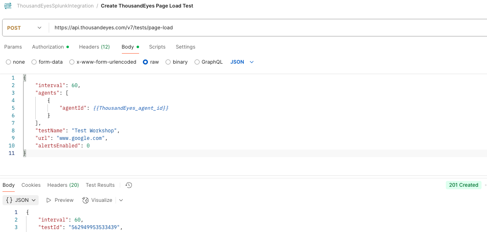
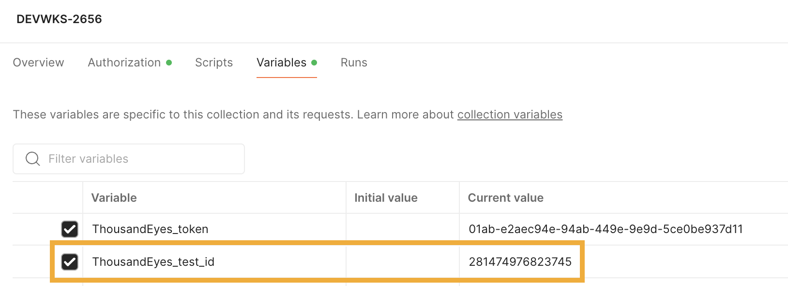

# Create ThousandEyes Page Load Test

For ThousandEyes to be able to stream data to Splunk, the data first needs to be collected by ThousandEyes. To achieve this, we
need to create a ThousandEyes test.
Refer to [ThousandEyes documentation](https://docs.thousandeyes.com/product-documentation/tests) for test creation.

We are going to create a `Page Load` test that validates the availability of `www.google.com`.

Choose one of the following methods to create your test:

=== "API Method"

    Use the ThousandEyes API through Postman to create the test programmatically.
    
    ### Prerequisites
    - Ensure you have your ThousandEyes bearer token configured in Postman
    - Have the ThousandEyes Splunk Integration collection imported in Postman
    
    ### Create Test via API
    - Open the `Create ThousandEyes Page Load Test` request in your Postman collection
    - Click **Send** to execute the API request
    
    
    
    ### Save Test ID
    - Copy the `testId` from the API response
    - In Postman, go to your collection **Variables**
    - Find the `ThousandEyes_test_id` variable
    - Paste the test ID in the **Current Value** field
    - Click **Save**
    
    
    
    !!! tip "Agent Selection"
        You can use different `agentId` values using the [ThousandEyes API List Agents](https://developer.cisco.com/docs/thousandeyes/list-cloud-and-enterprise-agents). See [more info](<get_agent_id.md>) for details.

    Full description of the API request is available at [ThousandEyes API Reference](https://developer.cisco.com/docs/thousandeyes/create-http-server-test).

=== "UI Method"

    Use the ThousandEyes web interface to create the test manually.
    
    ### Prerequisites
    - Be logged into your ThousandEyes account
    - Navigate to the ThousandEyes dashboard
    
    ### Create Test via UI
    - In the ThousandEyes dashboard, click **Test Settings**
    - Click the **+ Add New Test** button
    - Select **Page Load** from the test type options
    
    ### Configure Test Settings
    - **Test Name**: Enter a descriptive name (e.g., "Google Page Load Test")
    - **URL**: Enter `https://www.google.com`
    - **Interval**: Set to desired frequency (e.g., 5 minutes)
    - **Alerts**: Configure as needed or leave default
    
    ### Select Agents
    - In the **Agents** section, select one or more Cloud Agents
    - Choose agents from different geographic locations for better coverage
    - Click **Create New Test**
    
    ### Get Test ID for API Integration
    - After creating the test, click on the test name to view details
    - In the URL bar, note the test ID number (e.g., `/tests/12345`)
    - Copy this test ID for use in Postman variables
    - In Postman, set the `ThousandEyes_test_id` variable to this value
    
    !!! note "Test ID Location"
        The test ID can be found in the browser URL when viewing the test details, or in the test settings page.
