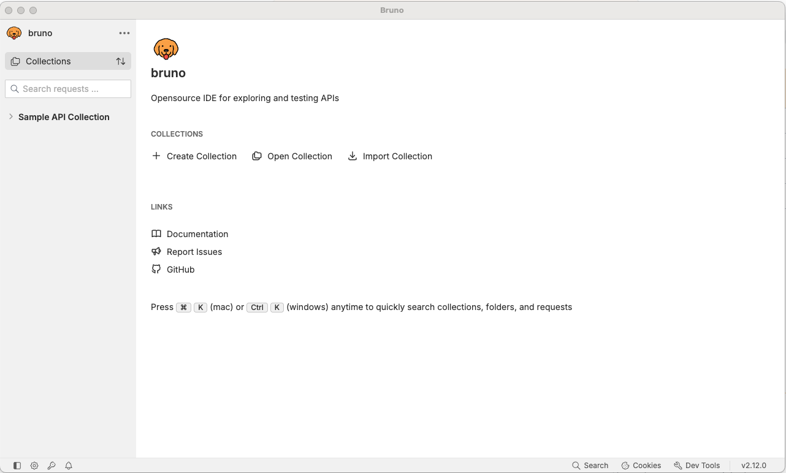
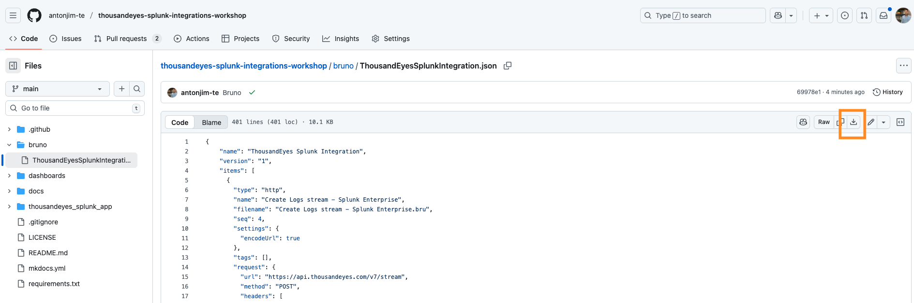
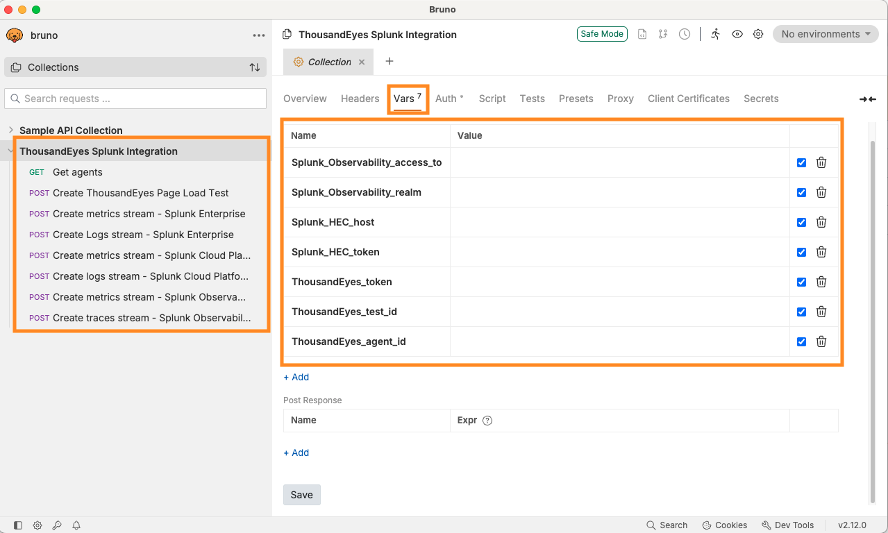

# Access Bruno

- Install Bruno [https://www.usebruno.com/downloads](https://www.usebruno.com/downloads)
- Open Bruno

## Import the collection

- Download the [Bruno collection file](https://github.com/antonjim-te/thousandeyes-splunk-integrations-workshop/blob/main/bruno/ThousandEyesSplunkIntegration.json) from the repository.

- Import the collection in Bruno.
- Navigate to the new collection called `ThousandEyes Splunk Integration`
- Verify that the collection `ThousandEyes Splunk Integration` is loaded, including requests and variables.

    
