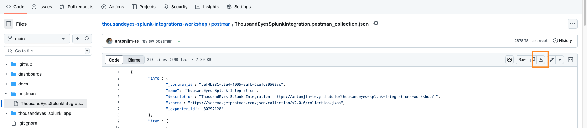
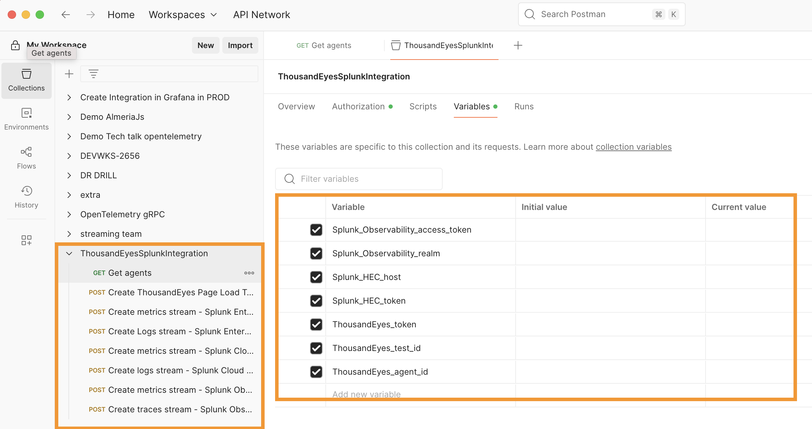

# Access Postman

Choose one of the following options to access Postman:

=== "Login to Existing Account"

    If you already have a Postman account:
    
    - Navigate to [Postman Login](https://identity.getpostman.com/login)
    - Enter your credentials to sign in
    

=== "Free Trial"

    If you don't have a Postman account:
    
    - Navigate to [Postman Sign Up](https://identity.getpostman.com/signup)
    - Create a new account with your email
    - Follow the verification process
    - Access Postman with your new account

## Import Workspace

Once you have access to Postman:

- Download [Postman collection file](https://github.com/antonjim-te/thousandeyes-splunk-integrations-workshop/blob/main/postman/ThousandEyesSplunkIntegration.postman_collection.json) from the workshop repository

- Import the collection in postman
- Navigate to the new collection `ThousandEyesSplunkIntegration`
- Verify the collection `ThousandEyesSplunkIntegration` is loaded, including requests and variables.

