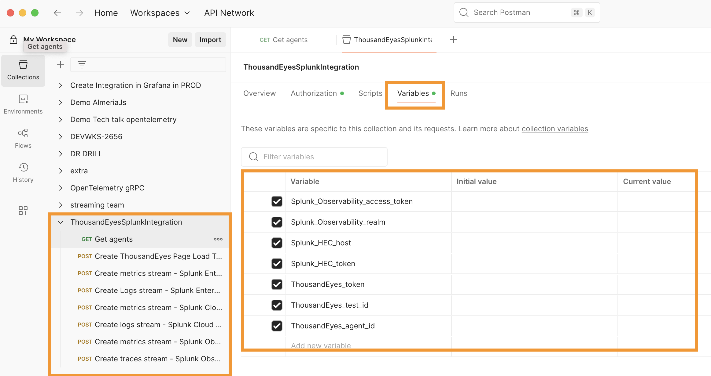

# Access Postman

## 1. Sign in

Choose one of the following options to access Postman:

=== "Log in to Existing Account"
<!-- FIXME: Consistency note: the headings in the top-level README.md use sentence case; elsewhere (such as here) I'm seeing headline case. -->

    If you already have a Postman account:
    
    - Navigate to the [Postman Login](https://identity.getpostman.com/login)
    - Enter your credentials to sign in
    

=== "Free Trial"

    If you don't have a Postman account:
    
    - Navigate to [Postman Sign Up](https://identity.getpostman.com/signup)
    - Create a new account with your email
    - Follow the verification process
    - Access Postman with your new account

## 2. Import the Workspace

Once you have access to Postman:

1. Download the [Postman collection file](https://github.com/antonjim-te/thousandeyes-splunk-integrations-workshop/blob/main/postman/ThousandEyesSplunkIntegration.postman_collection.json) from the workshop repository
.
1. Import the collection in Postman.
1. Navigate to the new collection called `ThousandEyesSplunkIntegration`.
1. Verify that the `ThousandEyesSplunkIntegration` collection is loaded, including requests and variables.

   
