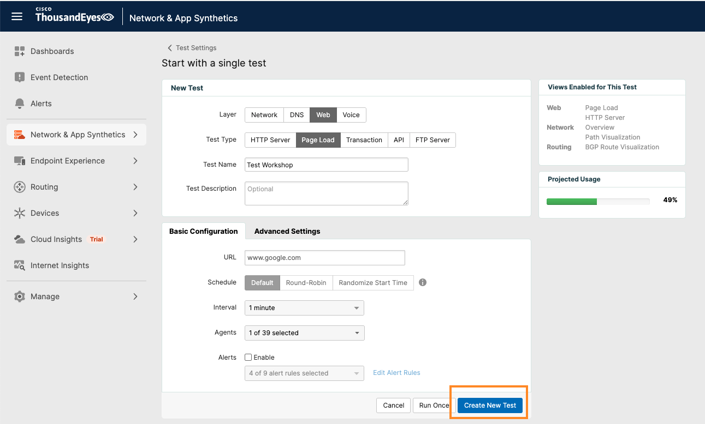

# Create ThousandEyes Page Load Test

For ThousandEyes to be able to stream data to Splunk, the data first needs to be collected by ThousandEyes. To achieve this, we
need to create a ThousandEyes test.
Refer to [ThousandEyes documentation](https://docs.thousandeyes.com/product-documentation/tests) for test creation.

We are going to create a `Page Load` test that validates the availability of `www.google.com`.

=== "API Method"

    Use the ThousandEyes API through Postman to create the test programmatically.
    
    ### Create Test via API
    - Open the `Create ThousandEyes Page Load Test` request in your Postman collection
    - Click `Send` to execute the API request
    
    
    
    ### Copy Test ID
    - Copy the `testId` from the API response
    
    !!! tip "Agent Selection"
        You can use different `agentId` values using the [ThousandEyes API List Agents](https://developer.cisco.com/docs/thousandeyes/list-cloud-and-enterprise-agents). See [more info](<get_agent_id.md>) for details.

    Full description of the API request is available at [ThousandEyes API Reference](https://developer.cisco.com/docs/thousandeyes/create-http-server-test).

=== "UI Method"

    Use the ThousandEyes web interface to create the test.
    
    ### Create Test via UI
    - Click on `Network & App Synthetics` in the left navigation bar
    - Select `Test Settings` from the dropdown menu
    - Click the `+ Add New Test` button
    - Select `Page Load` from the test type options
     

    -  Configure Test Settings
          - `Test Name`: Enter a descriptive name (e.g., "Test Workshop")
          - `URL`: Enter `https://www.google.com`
          - In the `Agents` section, select one or more Cloud Agents
          - Choose an agent.
    - Click `Create New Test`
    

    ### Get `Test ID`
    - After creating the test, click on the test name to view details
    - In the URL bar, note the `Test ID` number (e.g., `https://app.thousandeyes.com/network-app-synthetics/views/?testId=522030`)
    - Copy this `Test ID` for use in Postman variables

### Save the `Test ID` in Postman
- In Postman, go to your collection `Variables`
- Find the `ThousandEyes_test_id` variable
- Paste the test ID in the `Current Value` field
- Click `Save`

