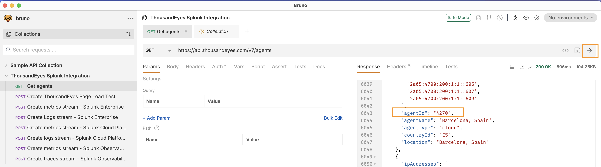
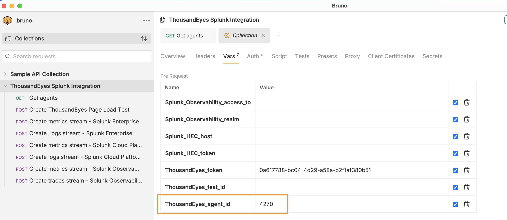

# Get ThousandEyes Agent Id for the creation of the ThousandEyes HTTP test

When creation the ThousandEyes test you will need to select an agent.

## Search for a new agentId

- Use the following Bruno request to get the agents 
- In the response, search for an agent
    - E.g `Barcelona` or `Atlanta`

!!! note "For our Splunk AppDynamics PS team members"
    When using AWS Account ID: `590189865299` in the eu-central-1 zone, please note that network traffic is open only for the agents listed below (`Security Group: Splunk-TE-Hackathon`):
    
    - `"agentId": "5", "agentName": "Atlanta, GA"`
    - `"agentId": "4270", "agentName": "Barcelona, Spain"`
    - `"agentId": "121", "agentName": "Warsaw, Poland"`
    - `"agentId": "7", "agentName": "Amsterdam, Netherlands"`
    - `"agentId": "32", "agentName": "London, England"`

- Save the `agentId` into the variable `ThousandEyes_agent_id` in Bruno 
