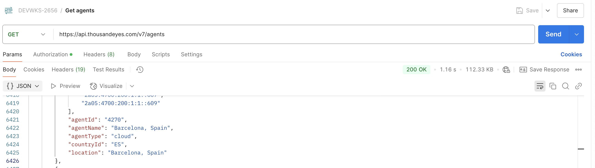
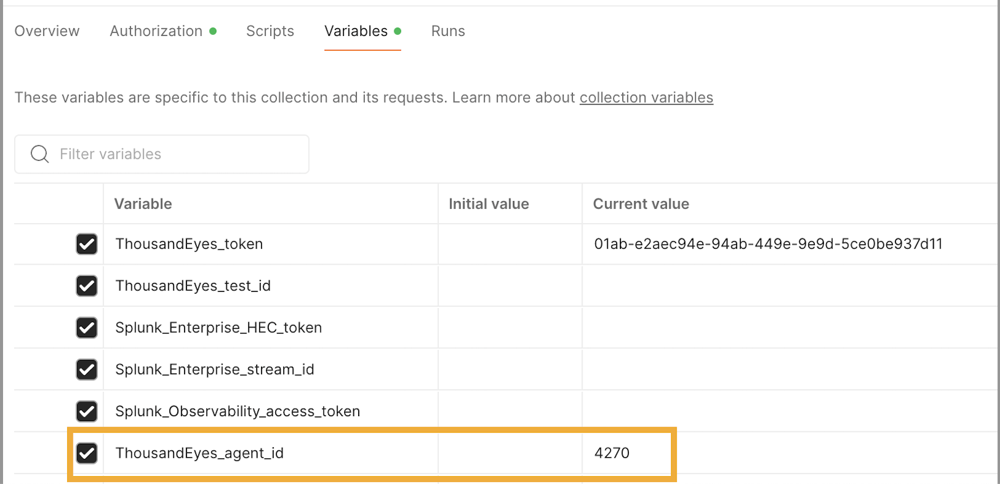

# Get ThousandEyes Agent Id for the creation of the ThousandEyes HTTP test

When creation the ThousandEyes test you will need to select an agent.

## Search for a new agentId

- Use the following Postman request to get the agents 
- In the resposne, search for an agent
    - E.g `Barcelona` or `Atlanta`
- Save the `agentId` into the variable `ThousandEyes_agent_id` in Postman 
