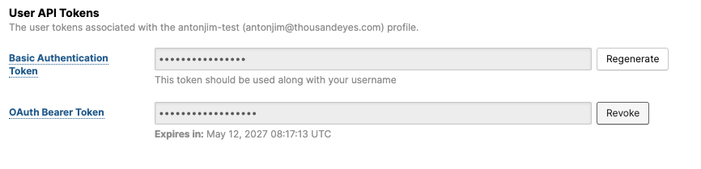

# Log In to ThousandEyes

Choose one of the following options to access ThousandEyes:

=== "Existing Account"

    If you already have a ThousandEyes account:
    
    - Go to the [ThousandEyes Log In page](https://app.thousandeyes.com/login).
    - Enter your email address and password
    - Click `Sign In`

=== "Free Trial"

    If you don't have a ThousandEyes account:
    
    - Navigate to [create a ThousandEyes Free Trial](https://www.thousandeyes.com/signup).
    - Fill out the registration form with your business information
    - Verify your email address
    - Sign in to your trial account.

## Get Your ThousandEyes Bearer Token

Once you're logged into ThousandEyes, follow these steps to generate your API bearer token:

- Navigate to User Profile
   - In the left-hand navigation bar:
       - select  `Manage >Account Settings > Users and Roles > Profiles`.
- Scroll down to the `User API Tokens` section
- Here you have two options:

=== "You already have a Bearer Token"

    If you remember your bearer token, you can skip to the next section.

    Else, you can revoke the existing token and generate a new one.
    - Click the `Revoke Token` button.
  
    

    - Copy the token
  
    

=== "You don't have a Bearer Token"

    If you don't have a bearer token, follow these steps to generate one:

    - Click `Generate OAuth Bearer Token` button.
    - Copy the token
  
    
  
## Add Your Token to Your Postman Variables

Now that you have your ThousandEyes bearer token, add it to your Postman collection variables:

- In Postman, navigate to your `ThousandEyes Splunk Integration` collection.
- Go to the `Variables` tab.
- Find the variable named `ThousandEyes_token` in the list.
    - In the `Current Value` column, paste your bearer token.
- Click `Save` to apply the changes.

    
