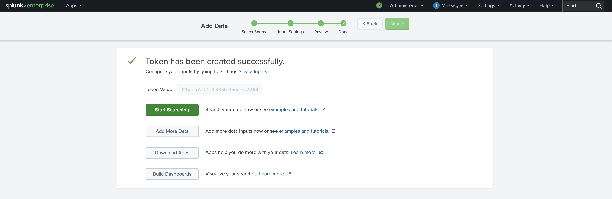
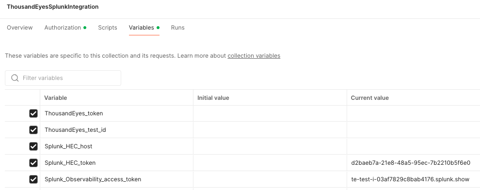

# Login to Splunk Cloud Platform or Splunk Enterprise

This guide will help you log into Splunk Cloud Platform or Splunk Enterprise and obtain an HEC token for the ThousandEyes stream.

## Choose Your Splunk Platform

=== "Splunk Cloud Platform"

    If you're using Splunk Cloud Platform:
    
    ### Login to Splunk Cloud
    - Navigate to your Splunk Cloud instance URL (e.g., `https://your-instance.splunkcloud.com`)
    - Enter your `username` and `password`
    - Click `Sign In`

    !!! warning "Trial Account Limitation"
        If you're using a Splunk Cloud trial account, you won't be able to stream ThousandEyes data due to the limitation https://ideas.splunk.com/ideas/PLECID-I-816

=== "Splunk Enterprise"

    If you're using Splunk Enterprise (on-premises):
    
    ### Login to Splunk Enterprise
    - Navigate to your Splunk Enterprise web interface (typically `https://your-server:8000`)
    - Enter your `username` and `password`
    - Click `Sign In`

## Get Splunk HEC Token

HTTP Event Collector (HEC) tokens are required to send data to Splunk from external sources like ThousandEyes.

- In Splunk Web, go to `Settings` in the top menu
- Click `Data Inputs` under the "Data" section
- Click `HTTP Event Collector`
- Click `New Token` button
- Configure the token settings
  - Give a name: `ThousandEyesToken`
- Click `Submit` to create the token
- Copy the HEC Token

## Identify HOST of your Splunk instance

- Splunk Enterprise: The host is typically the server name or IP address where Splunk is installed. For example, if you Splunk web page is `https://te-test-i-03af7829c8bab4176.splunk.show/en-GB/app/launcher/home`, your host will be: `te-test-i-03af7829c8bab4176.splunk.show`
- Splunk Cloud Platform: The host is the URL of your Splunk Cloud instance. For example, if your Splunk Cloud URL is `https://your-instance.splunkcloud.com`, your host will be `your-instance`

## Add HEC Token and Host to Postman Variables

Now that you have your Splunk HEC token, add it to your Postman collection variables:

- In Postman, navigate to your `ThousandEyes Splunk Integration` collection
- Go to the `Variables` tab
- Find the variable named `Splunk_HEC_token` in the list
    - In the `Current Value` column, paste your HEC token
- Find the variable named `Splunk_host` in the list
    - In the `Current Value` column, enter your Splunk host URL
- Click `Save` to apply the changes

!!! warning "Requirements"
    URL must be reachable and secure. [More info](https://docs.thousandeyes.com/product-documentation/integration-guides/custom-built-integrations/opentelemetry/configure-splunk-integrations#url-target-requirements)
