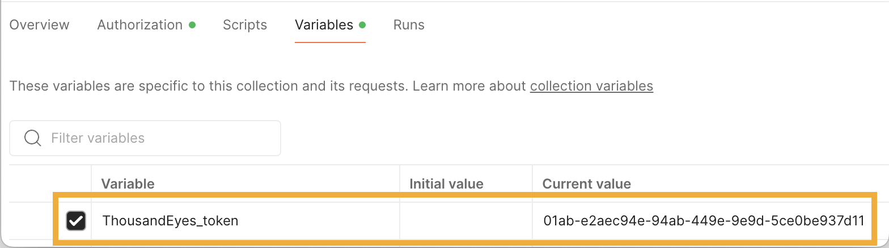

# Login to ThousandEyes

Choose one of the following options to access ThousandEyes:

=== "Existing Account"

    If you already have a ThousandEyes account:
    
    - Navigate to ThousandEyes Login
    - Go to [ThousandEyes Login](https://app.thousandeyes.com/login)
    - Enter your email address and password
    - Click *Sign In*

=== "Free Trial"

    If you don't have a ThousandEyes account:
    
    - Start Free Trial
    - Navigate to [ThousandEyes Free Trial](https://www.thousandeyes.com/signup)
    - Fill out the registration form with your business information
    - Verify your email address

## Get ThousandEyes Bearer Token

Once you're logged into ThousandEyes, follow these steps to generate your API bearer token:

### Navigate to User Profile
- Click on your *profile icon* in the top-right corner of the ThousandEyes dashboard
- Select *Account Settings* from the dropdown menu
- Navigate to *Users and Roles* → *Profile*

### Generate API Token
- Scroll down to the *API Tokens* section
- Click *Generate API Token* button
- Copy the token immediately - it will only be displayed once
- Store the token securely (you'll need it for the next step)

## Add Token to Postman Variables

Now that you have your ThousandEyes bearer token, add it to your Postman collection variables:

### Open Collection Variables
- In Postman, navigate to your *ThousandEyes Splunk Integration* collection
- Click on the *collection* to open its settings
- Go to the *Variables* tab

### Set the ThousandEyes_token Variable
- Find the variable named `ThousandEyes_token` in the list
- In the *Current Value* column, paste your bearer token
- Click *Save* to apply the changes

