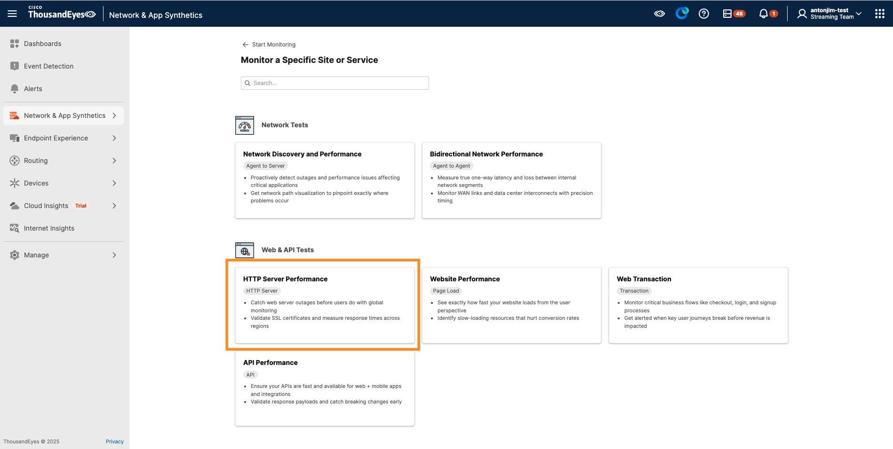
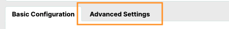
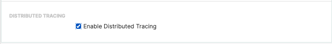
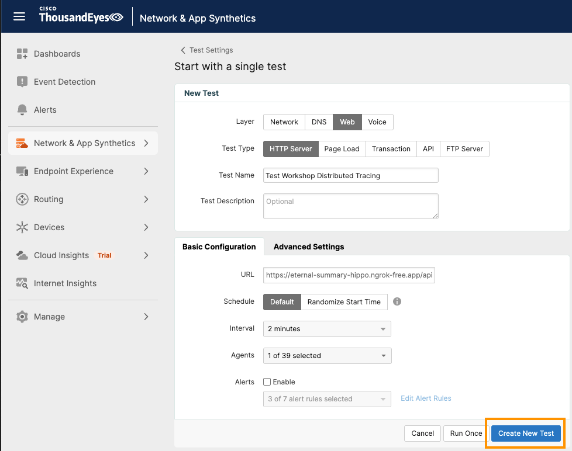

# Create a ThousandEyes HTTP Test with Distributed Tracing

We are going to create a `HTTP Test` test to our endpoint `<your_ngrok_domain>/api/cart`

Refer to [ThousandEyes documentation](https://docs.thousandeyes.com/product-documentation/tests) for test creation.

Use the ThousandEyes web interface to create the test.

- Click on `Network & App Synthetics` in the left navigation bar
- Select `Test Settings` from the dropdown menu
- Click the `+ Add New Test` button
- Select `HTTP Test` from the test type options

- Configure Test Settings
      - `Test Name`: Enter a descriptive name (e.g., "Test Workshop Distributed Tracing")
      - `URL`: Enter `<your_ngrok_domain>/api/cart`
      - In the `Agents` section, select a Cloud Agent
      - Under `Advanced settings`: 
          - Check `Enable Distributed Tracing`
          
- Click `Create New Test`

