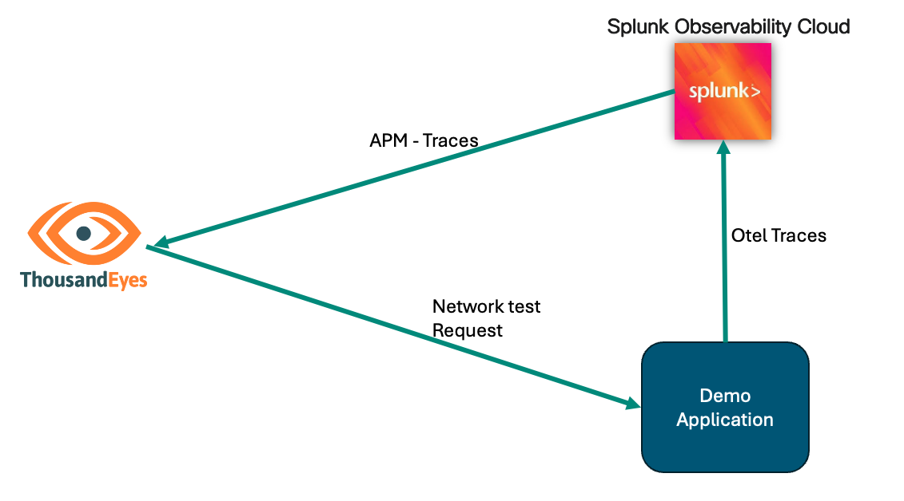

# Getting Started with Distributed Tracing in Splunk Observability

In the advanced section of the Distributed Tracing Service Map documentation, we will walk through the steps to set up the [OpenTelemetry demo application](https://opentelemetry.io/docs/demo/) publicly available and configure it to send traces to Splunk Observability. This will allow you to visualize the service map in ThousandEyes and traces in Splunk Observability.

### Prerequisites
- ThousandEyes account
- Ngrok account
- Splunk Observability account
- git
- docker compose

### Diagram

