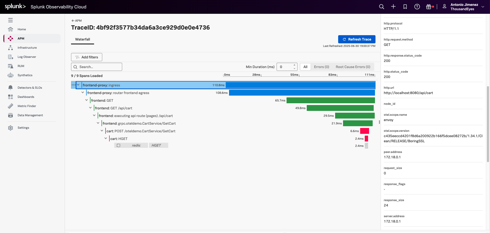
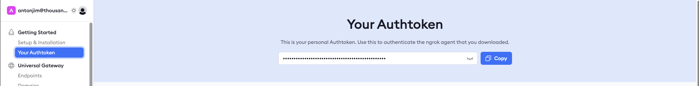
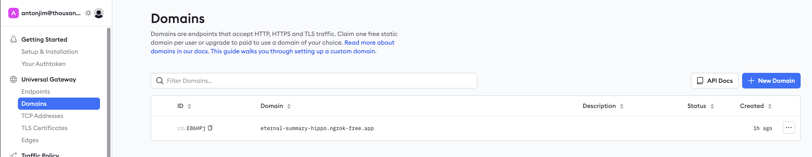

# Getting Started with Distributed Tracing in Splunk Observability

In the advanced section of the Distributed Tracing Service Map documentation, we will walk through the steps to set up the [OpenTelemetry demo application](https://opentelemetry.io/docs/demo/) publicly available and configure it to send traces to Splunk Observability. This will allow you to visualize the service map in ThousandEyes and traces in Splunk Observability.

### Prerequisites
- Ngrok account
- Splunk Observability account
- git
- docker compose

## Running the OpenTelemetry demo application locally

- Clone the [OpenTelemetry demo application](https://github.com/open-telemetry/opentelemetry-demo) repository.
```
git clone https://github.com/open-telemetry/opentelemetry-demo.git
cd opentelemetry-demo
```

- Update the trace exporter to send to Splunk Observability.
    - Change `src/otel-collector/otelcol-config-extras.yml`
    ```
    exporters:
      otlphttp/splunk:
        traces_endpoint: https://ingest.<Splunk_Observability_realm>.signalfx.com:443/v2/trace/otlp
        headers:
        "X-SF-Token": "<Splunk_Observability_access_token>"
        "Content-Type": "application/x-protobuf"

    service:
      pipelines:
        traces:
        exporters: [spanmetrics, otlphttp/splunk]
    ```
        - Replace `<Splunk_Observability_realm>` with your Splunk Observability realm (e.g., `us0`, `us1`, `eu0`, etc.)
        - Replace `<Splunk_Observability_access_token>` with your Splunk Observability access token.
- Start the OpenTelemetry demo application
```
docker compose up --force-recreate --remove-orphans --detach
```

- Verify that the application is running by visiting [http://localhost:8080](http://localhost:8080) in your web browser. You should see the OpenTelemetry demo application homepage.

## View a trace in Splunk Observability

- Call a REST API of the OpenTelemetry demo application to generate some traces
```
curl http://localhost:8080/api/cart -H 'traceparent: 00-4bf92f3577b34da6a3ce929d0e0e4736-00f067aa0ba902b7-01'
```
- Open the trace [https://app.us1.signalfx.com/#/apm/traces/4bf92f3577b34da6a3ce929d0e0e4736](https://app.us1.signalfx.com/#/apm/traces/4bf92f3577b34da6a3ce929d0e0e4736).



## Reverse proxy

We need to expose the OpenTelemetry demo application to the internet to be able create the ThousandEyes test. We can use a reverse proxy like [ngrok](https://ngrok.com/) to do this.

### Configure ngrok

- Sign up/log in at [Ngrok](https://ngrok.com/signup). 
- Retrieve your authentication token from the [ngrok Authtoken page](https://dashboard.ngrok.com/get-started/your-authtoken). 
- Navigate to the [ngrok Domains page](https://dashboard.ngrok.com/domains) and create a new domain. This ensures your domain remains static even after ngrok container restarts.
  - Example `eternal-summary-hippo.ngrok-free.app` 
  
### Add ngrok to the docker compose 

- Change `opentelemetry-demo/docker-compose.yml` 
```yaml
ngrok:
    image: ngrok/ngrok
    container_name: ngrok
    command: ["http", "http://frontend-proxy:${ENVOY_PORT}", "--url=${NGROK_DOMAIN}", "--host-header=${NGROK_DOMAIN}"]
    restart: unless-stopped
    environment:
    - NGROK_AUTHTOKEN="${NGROK_AUTHTOKEN}"
    - ENVOY_PORT
    - NGROK_DOMAIN
    depends_on:
    frontend-proxy:
        condition: service_started
    logging: *logging
```
- Change `opentelemetry-demo/.env`
    - Add the following variables:
        ```env
        NGROK_AUTHTOKEN=<your_ngrok_auth_token>
        NGROK_DOMAIN=<your_ngrok_domain>
        ```
    - Example:
        ```env
        NGROK_AUTHTOKEN=21iZFQf5FYHou7VXd5yk1gOICI9_R46omx9uKSNnwSPiaH7N
        NGROK_DOMAIN=eternal-summary-hippo.ngrok-free.app
        ```
- Restart the OpenTelemetry demo application
```
docker compose up --force-recreate --remove-orphans --detach
```

### View a trace in Splunk Observability

- Call a REST API of the OpenTelemetry demo application to generate some traces.
```
curl <your_ngrok_domain>/api/cart -H 'traceparent: 00-1bf32f3577b34da6a3ce929d0e0e4736-00f067aa0ba902b7-01'
```
    - Example:
    ```
    curl https://eternal-summary-hippo.ngrok-free.app/api/cart -H 'traceparent: 00-1bf32f3577b34da6a3ce929d0e0e4736-00f067aa0ba902b7-01'
    ```
- Open the trace [https://app.us1.signalfx.com/#/apm/traces/1bf32f3577b34da6a3ce929d0e0e4736](https://app.us1.signalfx.com/#/apm/traces/1bf32f3577b34da6a3ce929d0e0e4736).

