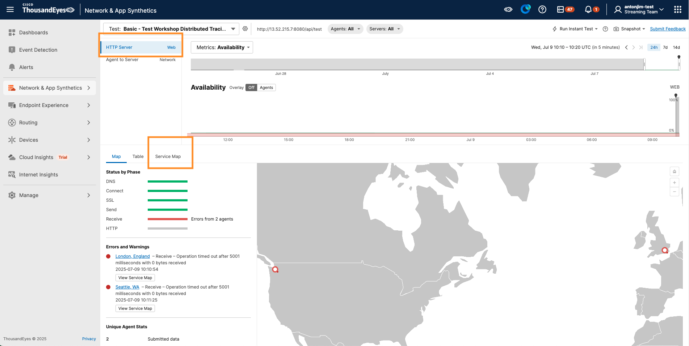
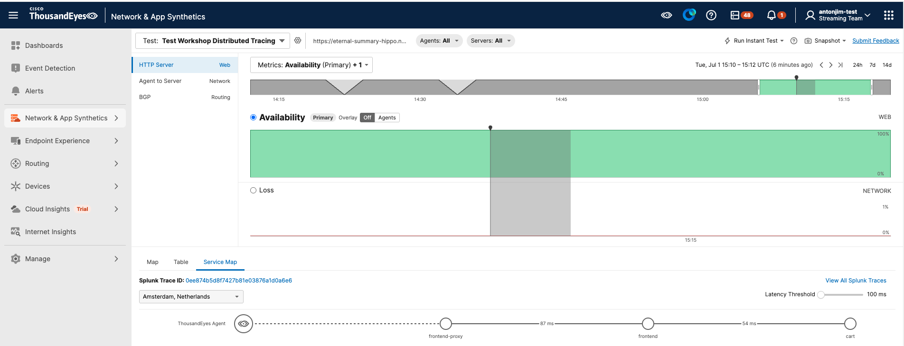
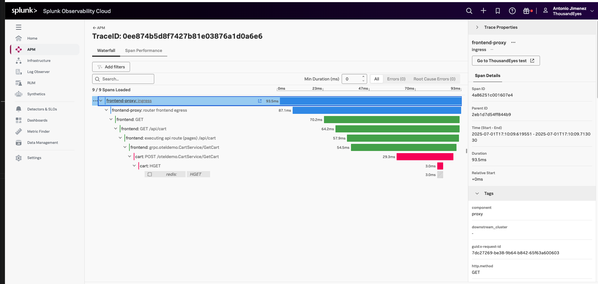

# View the Service Map in Splunk Observability

Under `Network & App Synthetics` -> `Views`, you can select your  HTTP Test to view.

- As you enabled the Distributed Tracing in the test. ThousandEyes automatically injects the following trace headers into requests:
      - `b3`
      - `traceparent`
      - `tracestate`

- Under the `HTTP Server` layer, open the `Service Map` tab.
      - Use the service map to analyze the trace path:
      - The services involved in the request.
      - Any latency issues, highlighted in red if thresholds are exceeded.
      - Any errors between services, shown as red lines if a request fails.
      - Trace metadata, such as the trace ID and request flow details.

!!! note "Data may not be ready - Wait a few minutes"
    The trace needs to be generated by the application and send to Splunk Observability Cloud. This may take a few minutes after the test is created. If you do not see any traces, wait a few minutes and refresh the page.

## Debug the Trace in Splunk Observability Cloud

From the **Service Map** tab in ThousandEyes, follow the link to the trace in Splunk. There, you can:

* Drill into service-level trace data.
* Use Splunk’s trace search, filters, and dashboards for deeper analysis.

Splunk enriches the trace with the following attributes:

- `thousandeyes.account.id`
- `thousandeyes.test.id`
- `thousandeyes.permalink`
- `thousandeyes.source.agent.id`

These attributes provide context and allow you to navigate back to the related test in ThousandEyes.

In the Splunk Observability Cloud, you will have a link back to ThousandEyes, allowing you to easily navigate between the two platforms for a comprehensive view of your distributed tracing data.

