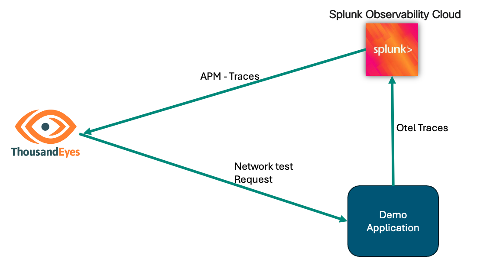

# Getting Started with Distributed Tracing in Splunk Observability

In the advanced section of the Distributed Tracing Service Map documentation, we will walk through the steps to set up the [OpenTelemetry demo application](https://opentelemetry.io/docs/demo/) publicly available and configure it to send traces to Splunk Observability. This will allow you to visualize the service map in ThousandEyes and see traces in Splunk Observability. 

This part of the documentation is applicable if you plan to run your OTel demo application on AWS, not locally. 

### Prerequisites
- ThousandEyes account
- AWS account
	- EC2 instance
		- [git](https://git-scm.com/book/en/v2/Getting-Started-Installing-Git)
		- [docker](https://docs.docker.com/engine/install/)
- Splunk Observability account

### Diagram

### Recording

Please see below a recorded video walkthrough that covers the steps in the Advanced Integration part. It shows how to set up the OpenTelemetry demo application locally (not in AWS) and visualize the service map in ThousandEyes.

	<iframe src="https://app.vidcast.io/share/embed/8206cfdd-7314-4b37-9f14-32988927d9b3?disableCopyDropdown=1" width="100%" height="100%" title="service-map-integration" loading="lazy" allow="fullscreen *;autoplay *;" style="position: absolute; top:0; left: 0; border: solid; border-radius: 12px;"></iframe>

