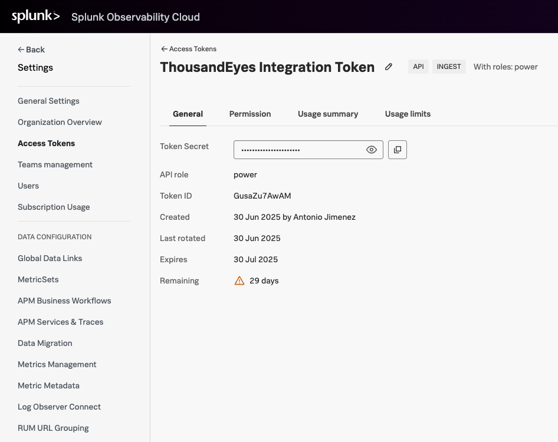

# Log In to Splunk Observability Cloud

This guide will help you log into Splunk Observability Cloud and obtain an access token for the ThousandEyes stream.

=== "Existing Account with *Admin* Privileges"

    If you already have a Splunk Observability Cloud account and you have *Admin* privileges:
    
    ### Log In to Your Account
    - Navigate to [Splunk Observability Cloud](https://login.signalfx.com/)
    - Enter your `email address` and `password`
    - Click `Sign In`

    !!! note "If you are in Splunk AppDynamics PS Team"
        You should have access to Splunk Observability Cloud Playground - please log in at https://app.us1.signalfx.com and use your Cisco credentials.

=== "Free Trial"

    If you don't have a Splunk Observability Cloud account:
    
    ### Start Free Trial
    - Navigate to [Splunk Observability Cloud Free Trial](https://www.splunk.com/en_us/products/observability-cloud.html)
    - Click `Start Free Trial` or `Try Free`
    - Fill out the registration form with your business information:
    
    ### Verify Your Account
    - Check your email for a verification message
    - Click the verification link to activate your account
    - Complete your profile setup
    - Access your new Splunk Observability Cloud dashboard

## Generate Access Token

Once you're logged into Splunk Observability Cloud, generate your access token:

- Navigate to the `Settings` -> `Access Tokens`
- Click `Create Token`
- Configure the token settings:
    - `Name`: Enter a descriptive name (e.g., "ThousandEyes Integration Token")
    - `Scope`: Select `INGEST` and `API` 
        - Check `Please accept to continue with your selection.`
- Click `Next` to proceed the `Name and Scope` section
- Keep the default permissions settings
- Click `Next` to proceed the `Permissions` section
- Set appropriate `Expiration date` (e.g. one day)
- Click `Create Token`
- Copy the token

