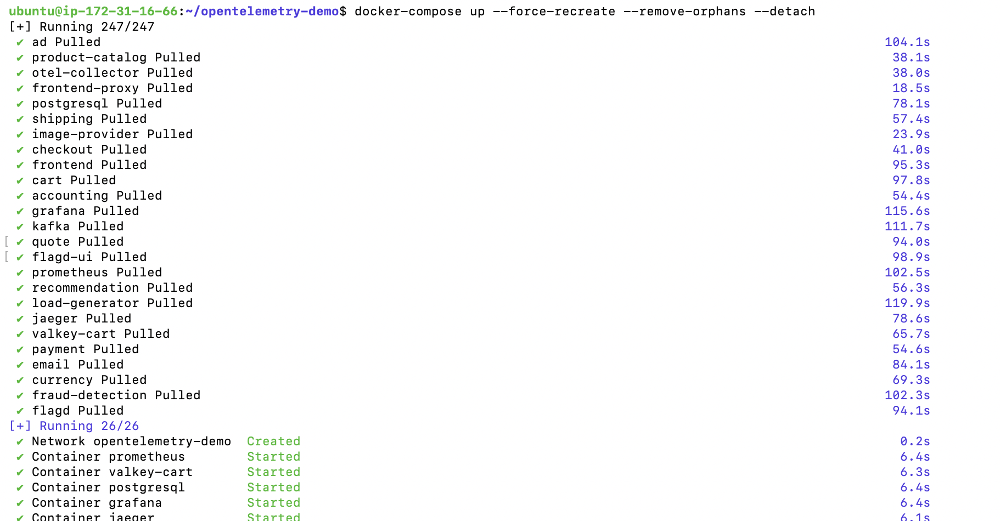
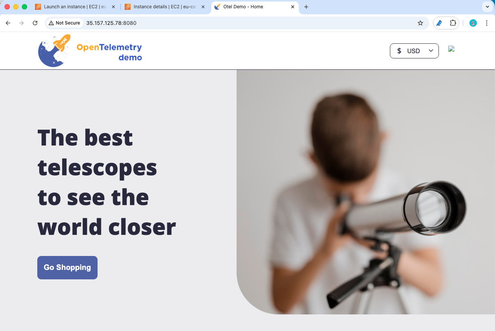
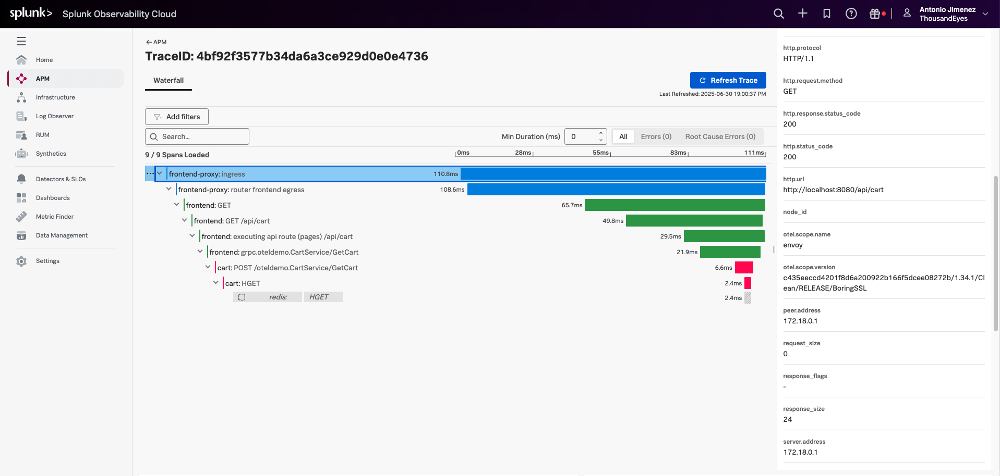

# Running the OpenTelemetry demo application in AWS
- Clone the [OpenTelemetry demo application](https://github.com/open-telemetry/opentelemetry-demo) repository.
```
git clone https://github.com/open-telemetry/opentelemetry-demo.git
cd opentelemetry-demo
```

- Update the trace exporter to send to Splunk Observability.
    - Change `src/otel-collector/otelcol-config-extras.yml`
    ```
    exporters:
      otlphttp/splunk:
        traces_endpoint: https://ingest.<Splunk_Observability_realm>.signalfx.com:443/v2/trace/otlp
        headers:
            "X-SF-Token": "<Splunk_Observability_access_token>"
            "Content-Type": "application/x-protobuf"

    service:
      pipelines:
        traces:
            exporters: [spanmetrics, otlphttp/splunk]
    ```
        - Replace `<Splunk_Observability_realm>` with your Splunk Observability realm (e.g., `us0`, `us1`, `eu0`, etc.)
        - Replace `<Splunk_Observability_access_token>` with your Splunk Observability access token.

- Start the OpenTelemetry demo application
```
docker-compose up --force-recreate --remove-orphans --detach
```

    


!!! warning "You may encounter issues with OpenSearch container during startup"
    Since we don't need it in this lab, please remove its configuration from `docker-compose.yml` file.
    
      - If you have already run `docker compose up` please run `docker compose down`
      - Locate the opensearch service section and either remove it or comment it out
      - Comment/Remove opensearch from the otel-collector service's depends_on section


- Verify that the application is running by visiting `http://<your-ec2-public-ip>:8080` in your web browser. You should see the OpenTelemetry demo application homepage.

    

## View a trace in Splunk Observability

- Call a REST API of the OpenTelemetry demo application to generate some traces
    - Firsty create a random traceparent ID. Example of traceparent ID is  `00-7b8aa5a2d2c872e8321cf37308d69df3-051581bf3cb55c14-01`.
    - Call a REST API
      ```
      curl http://<your-ec2-public-ip>:8080/api/cart -H 'traceparent: <your-traceparent-ID>
      ```
        - example:
        ```
        curl http://<your-ec2-public-ip>:8080/api/cart -H 'traceparent: 00-7b8aa5a2d2c872e8321cf37308d69df3-00f067aa0ba902b7-01'
        ```

- Open the trace: [https://app.us1.signalfx.com/#/apm/traces/7b8aa5a2d2c872e8321cf37308d69df3](https://app.us1.signalfx.com/#/apm/traces/7b8aa5a2d2c872e8321cf37308d69df3)

Please note that it can take up to 10 minutes to see the trace in Splunk.


