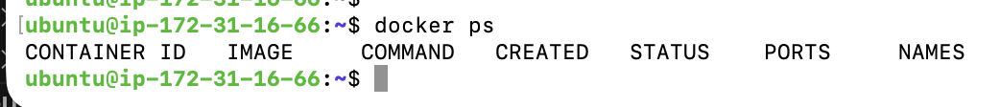
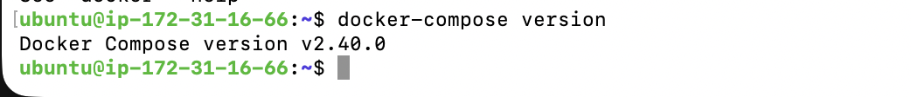

# Setup AWS EC2

## Launch an AWS EC2 Instance

- Launch an AWS EC2 Instance
- Click Launch Instance and configure the instance with the following specifications: 
    - Name: `<your-unique-ID>-te-splunk-otel-demo`
    - AMI: Choose an Ubuntu Server AMI (e.g., Ubuntu Server 24.04 LTS).
    - Instance Type: Select an instance with 6 GB RAM or more (e.g., t3.large).
    - Key pair: you can use your key or create a new one
    - Storage: Allocate 30 GB of disk space
    - Security Group Rules:
        - If possible, please select a Security Group that allows inbound connections from any IP address. If not possible, please make sure that you can access the server and allow inbound connections from the chosen ThousandEyes Cloud Agents that you will use during this workshop. You can obtain a list of ThousandEyes Agent IP addresses by using an API request provided in the Bruno collection. Please make sure to add the ThousandEyes Bearer token in Bruno variables before sendingbr the API request. Documentation on how to obtain a list of ThousandEyes Agents can be found here: [Obtaining a list of ThousandEyes Agent IP](https://docs.thousandeyes.com/product-documentation/global-vantage-points/obtaining-a-list-of-thousandeyes-agent-ip-addresses-with-te-iplist).  
            
- Once configured, please launch the instance and connect to it using SSH. Replace `<your-private-keyfile.pem>` with your SSH key file and `<your-ec2-public-ip>` with your instance's
public IP address: 
```
ssh -i <your-private-key-file.pem> ubuntu@<your-ec2-public-ip>
```

!!! warning "If you decided to use `splunk-te-otel-key`"
    please remember to download it and set correct permission using this command: 
    ```
    chmod 400 "splunk-te-otel-key.pem"
    ```

## Prepare Ubuntu Instance

- Update system packages and install git and curl

```
sudo apt update && sudo apt upgrade -y
sudo apt install -y git curl
```

- Install and configure Docker
    -  Install Docker 
        ```
        sudo apt install -y docker.io
        ```
    - Start and enable the Docker service to run on boot:
        ```
        sudo systemctl start docker
        sudo systemctl enable docker
        ```
    - Verify the Docker installation:
        ```
        docker --version
        ```

- Add User to the Docker Group
    - To execute Docker commands without sudo, add your current user to the docker group. This change requires logging out and back in. 
        ```
        sudo usermod -aG docker $USER
        ```
    - To apply chnages you must log out and log in again:

        ```
        exit
        ssh -i <your-private-key-file.pem> ubuntu@<your-ec2-public-ip>
        ```

    - Verify that you can run Docker:
        ```
        docker ps
        ```
    If the command executes successfully and without permission errors, you can proceed: 
    
    


-  Install Docker Compose
    - To install Docker Compose, you can use the below commands. Please download the latest version of Docker Compose from the official GitHub repository.
        ```
        sudo curl -L "https://github.com/docker/compose/releases/latest/download/docker-compose-$(uname -s)-$(uname -m)" -o /usr/local/bin/docker-compose
        ```

    - Make the plugin executable:
        ```
        sudo chmod +x /usr/local/bin/docker-compose
        ```

    - Verify the Docker Compose installation:
        ```
        docker-compose version
        ```
    