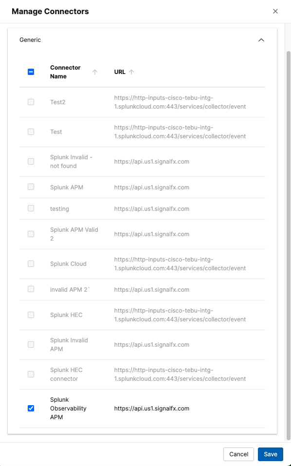

# Create a Splunk APM Integration

We need to provide to ThousandEyes the Splunk Observabiltiy APM url and token to be able to get the traces and represent it as a Service Map.
We will be using the credentials from the Splunk Observability owned by ThousandEyes, as the traces will be coming from the OpenTelemetry demo application running in the cloud.

- In the ThousandEyes platform, navigate to `Manage` > `Integrations` > `Integrations 2.0`
- Create a **Generic Connector** with the following details:
    - Click `+ New Connector`, then select `Generic Connector`
    - Enter the `Name`: `Splunk Observability APM`
    - Enter the `Target URL`: `https://api.us1.signalfx.com`
    - Select the `Splunk Observability APM` from the `Preset Configuration` dropdown
    - Set the Custom headers: `X-SF-Token`: `<To be shared during the workshop>`
    - Click `Save & Assign Operation`

    

-  Create an **Operation**:
      -  Click `+ New Operation` to open the menu to select the operation type
      -  Choose `Splunk Observability APM` to proceed to the configration form
      -  Enter the `Operation Name`: `Splunk Observability APM`
      - Click `Save & Assign Connector`

- Assign the Operation to the Connector:
      -  Select the `Splunk Observability APM` from the `Connector` dropdown
      -  Click `Save & Assign Operation`

