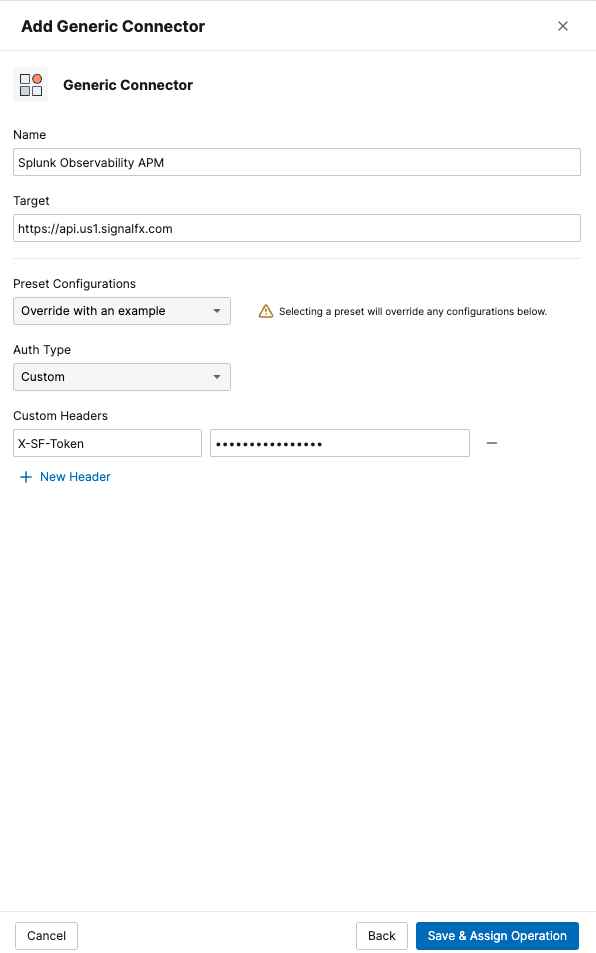
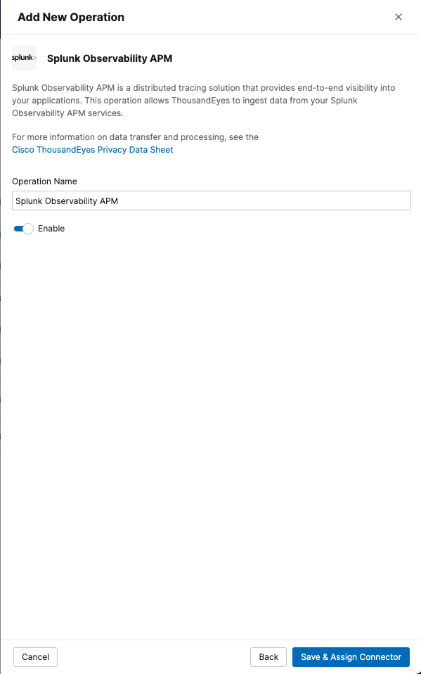

# Create a Splunk APM Integration

We need to provide to ThousandEyes the Splunk Observabiltiy APM url and token to be able to get the traces and represent it as a Service Map.
We will be using the credentials from the Splunk Observability owned by ThousandEyes, as the traces will be coming from the OpenTelemetry demo application running in the cloud.

- In the ThousandEyes platform, navigate to `Manage` > `Integrations` > `Integrations 2.0`
- Create a **Generic Connector** with the following details:
    - Target URL: `https://api.us1.signalfx.com`
    - Custom headers:
        - `X-SF-Token`: `<To be shared during the workshop>`
        - It will expire after a week after the workshop.

-  Create an **Operation**:
      -  Click `+ New Operation` to open the menu to select the operation type
      -  Choose `Splunk Observability APM` to proceed to the configration form
      -  Enter the Operation Name
      -  Enable the operation

