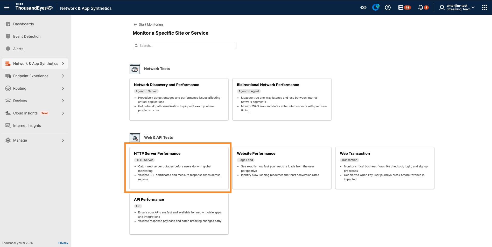
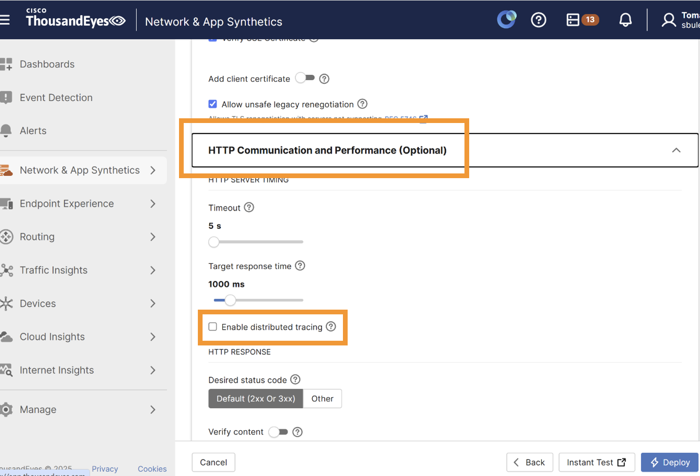
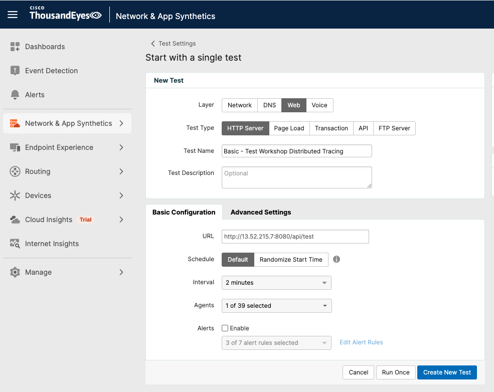

# Create a ThousandEyes HTTP Test with Distributed Tracing

We are going to create an `HTTP Test` for an endpoint of our OpenTelemetry demo application, which is already instrumented with OpenTelemetry and sending telemetry data to Splunk Observability.

Refer to [ThousandEyes documentation](https://docs.thousandeyes.com/product-documentation/tests) for test creation.

Use the ThousandEyes web interface to create the test.

- Click on `Network & App Synthetics` in the left navigation bar
- Select `Test Settings` from the dropdown menu
- Click the `+ Add New Test` button
- Select `HTTP Test` from the test type options

- Configure Test Settings
      - `Test Name`: e.g., "Basic - Test Distributed Tracing"
      - `URL`: Enter `http://13.52.215.7:8080/api/test`
      - In the `Agents` section, select a Cloud Agent
      - Under `HTTP Comunication and Performance (Optional)`, check `Enable Distributed Tracing`
          
- Click `Create New Test`

