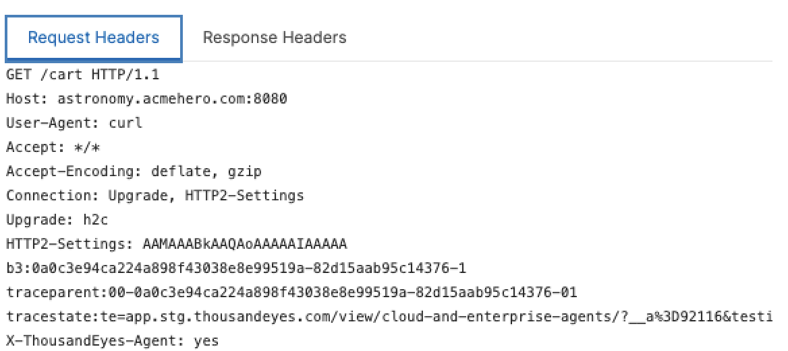
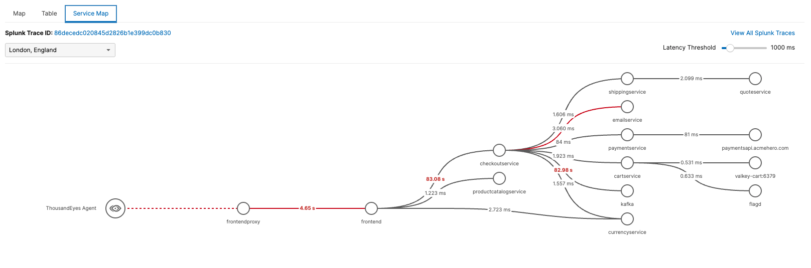
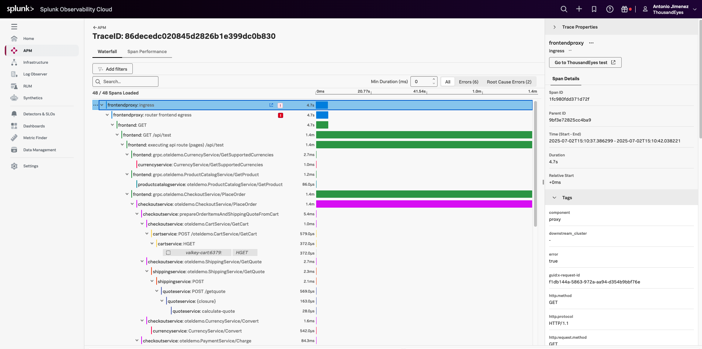
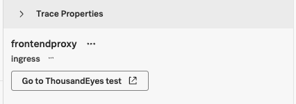

# View the Service Map in Splunk Observability

Access to the view of your ThousandEyes HTTP Test.

- As you enabled the Distributed Tracing in the test.
    - ThousandEyes automatically injects the following trace headers into requests:
          - `b3`
          - `traceparent`
          - `tracestate`

- Open the **Service Map** tab in ThousandEyes.
      - Use the service map to analyze the trace path:
          - The services involved in the request.
          - Any latency issues, highlighted in red if thresholds are exceeded.
          - Any errors between services, shown as red lines if a request fails.
          - Trace metadata, such as the trace ID and request flow details.

## Debug the Trace in Splunk Observability Cloud

As you dont have access to our Splunk Observability Cloud instance, you will not be able to access the traces in Splunk Observability Cloud. However, if you had access, you would follow these steps:

From the **Service Map** tab in ThousandEyes, follow the link to the trace in Splunk. There, you can:

* Drill into service-level trace data.
* Use Splunk’s trace search, filters, and dashboards for deeper analysis.

Splunk enriches the trace with the following attributes:

- `thousandeyes.account.id`
- `thousandeyes.test.id`
- `thousandeyes.permalink`
- `thousandeyes.source.agent.id`

These attributes provide context and allow you to navigate back to the related test in ThousandEyes.

In the Splunk Observability Cloud, you will have a link back to ThousandEyes, allowing you to easily navigate between the two platforms for a comprehensive view of your distributed tracing data.

