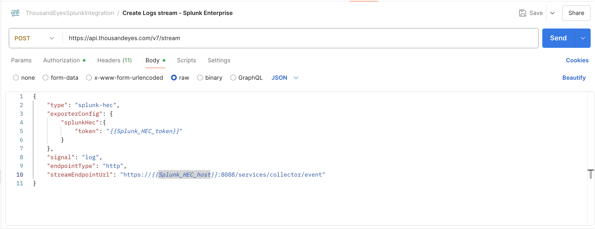
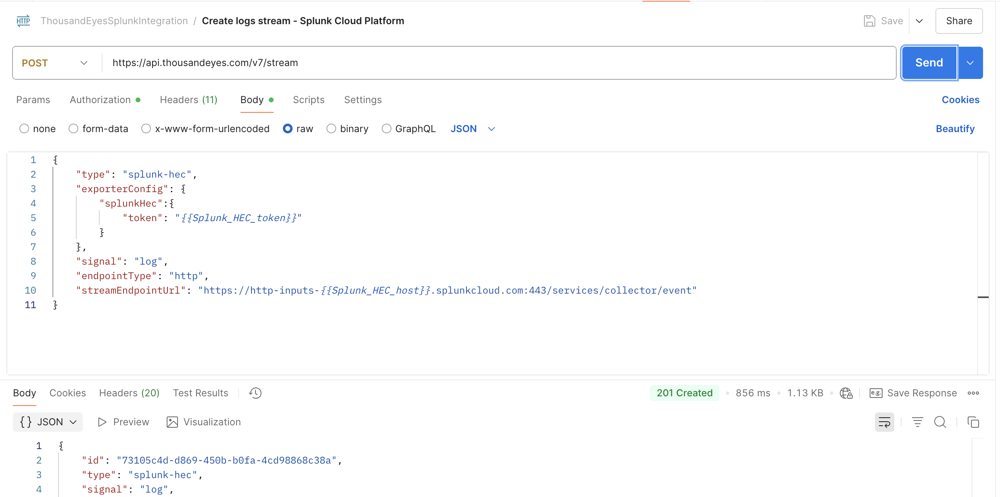
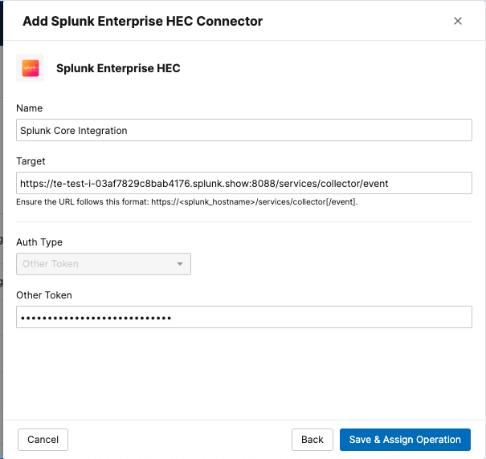
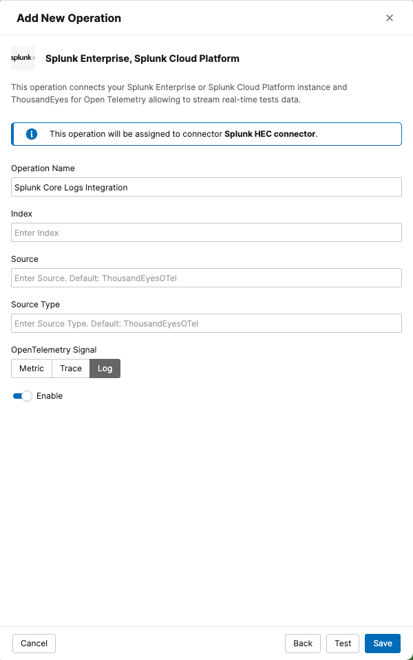

# Create Logs Stream on ThousandEyes for Splunk Cloud Platform or Splunk Enterprise

Choose one of the following methods to create your stream to Splunk Cloud Platform or Splunk Enterprise:

=== "API Method"

    === "Splunk Enterprise"
        Use the ThousandEyes API through Postman to create the stream programmatically.
        
        - Open the request in your Postman collection: `Create logs stream - Splunk Enterprise`
        - Click `Send` to execute the API request

        

    === "Splunk Cloud Platform"
        Use the ThousandEyes API through Postman to create the stream programmatically.
        
        - Open the request in your Postman collection: `Create logs stream - Splunk Cloud Platform`
        - Click `Send` to execute the API request

        

    !!! tip "API Documentation"
        For detailed API parameters and options, check the [ThousandEyes API documentation](https://developer.cisco.com/docs/thousandeyes/create-data-stream).

=== "UI Method (Under a feature flag)"

    Use the ThousandEyes web interface to create the integration manually using Integrations 2.0.

    - Navigate to `Manage` > `Integrations` > `Integrations 2.0`

    ### Create a Connector

    - Click `+ New Connector` to select the type of connector to configure
        - Splunk Cloud Platform: `Splunk Cloud Platform HEC`
        - Splunk Enterprise: `Splunk Enterprise HEC`
    - Configure Connector Settings    
        - `Name`: A name for your connector (e.g., "Splunk Core Integration")
        - `Target`: The target URL of the integration:
            - `Splunk Cloud Platform`: `https://http-inputs-<host>.splunkcloud.com:443/services/collector/event`
            - `Splunk Enterprise`: `https://<host>:8088/services/collector/event`
        - `Token`: Enter your Splunk HEC token
    - Click `Save & Assign Operation` to save the connector

    

    ### Create an Operation

    - Click `+ New Operation` to open the menu for selecting the operation type
    - Choose `Splunk Enterprise, Splunk Cloud Platform` to proceed to the configuration form
    - Configure Operation Settings
          - `Operation Name`: A name for your operation (e.g., "Splunk Core Logs Integration")
          - `Signal`: `logs`
    - Click `Save`

    

!!! note "Data Flow Timing"
    The stream will begin sending data to your Splunk instance within a few minutes of activation.
