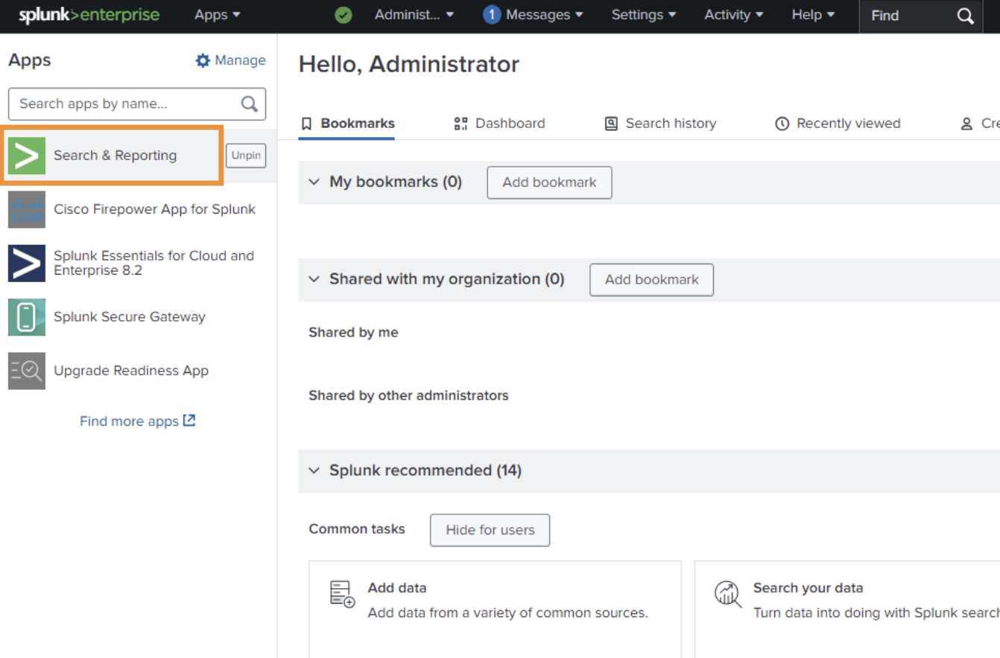
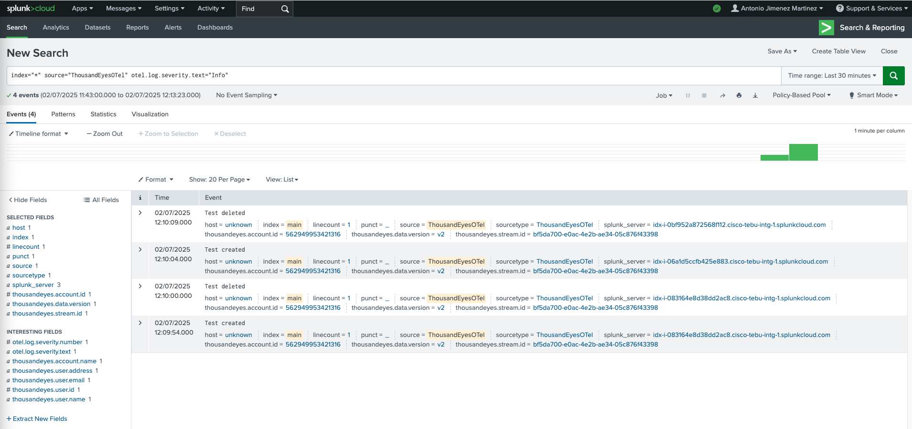

# Visualize ThousandEyes Logs in Splunk Cloud Platform or Splunk Enterprise

## Let's generate some logs
- In the ThousandEyes platform:
  - Log In to the ThousandEyes platform
  - Create a test
  - Update a test
  - Logout from the ThousandEyes platform

## Visualize ThousandEyes Logs in Splunk Cloud Platform or Splunk Enterprise

- In the initial page of Splunk page
- Navigate to `Search & Reporting`

- In the search bar, enter the following query to retrieve ThousandEyes Latency log:
```
index="*" source="ThousandEyesOTel" otel.log.severity.text="Info"
```

