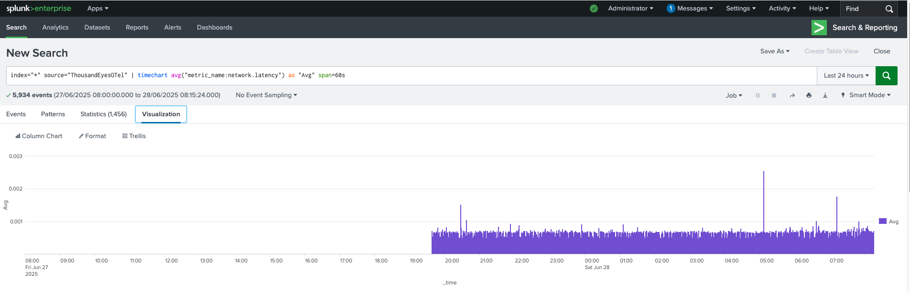
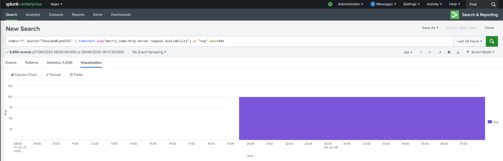

# Visualize ThousandEyes Metrics in Splunk Cloud Platform or Splunk Enterprise

- In the initial page of Splunk page
- Navigate to `Search & Reporting`

- In the search bar, enter the following query to retrieve ThousandEyes Latency metric:
```
index="*" source="ThousandEyesOTel" | timechart avg("metric_name:network.latency") as "Avg" span=60s
```
  - Click on the `Visualization` tab to change the chart type to `Line Chart`
  - 


- In the search bar, enter the following query to retrieve ThousandEyes availability metric:
```
index="*" source="ThousandEyesOTel" | timechart avg("metric_name:http.server.request.availability") as "Avg" span=60s
```
  - Click on the `Visualization` tab to change the chart type to `Line Chart`



- Now you have the options to:
    - Create alerts based on the search results
    - Save the search as a report
    - Create a dashboard panel
    - Export the results in various formats (CSV, JSON, etc.)
    - Correlate the data with other metrics in Splunk
    - Apply AIOps to analyze the data further