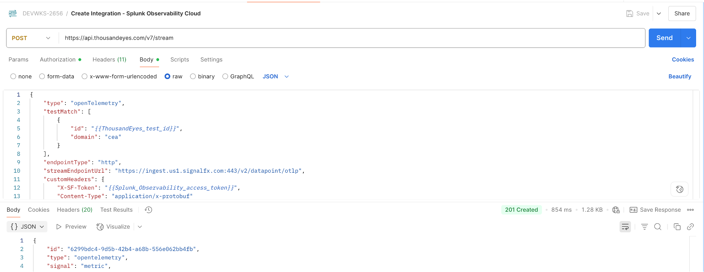

# Streams telemetry data to Splunk Observability Cloud

## Create Metrics Streams on ThousandEyes for Splunk Observability Cloud

Choose one of the following methods to create your stream to Splunk Observability Cloud:

=== "API Method"

    Use the ThousandEyes API through Postman to create the stream programmatically.
    
    ### Create Stream via API
    - Open the `Create metrics stream - Splunk Observability` request in your Postman collection
    - Review the request body and ensure all required fields are configured:
    - Click `Send` to execute the API request
    
    
    
    !!! tip "API Documentation"
        For detailed API parameters and options, check the [ThousandEyes API documentation](https://developer.cisco.com/docs/thousandeyes/create-data-stream).

=== "UI Method"

    Use the ThousandEyes web interface to create the stream integration manually via OpenTelemetry.
    
    To integrate Splunk Observability Cloud with ThousandEyes, follow these steps:
    
    ### Navigate to Integrations
    - Log in to your account on the ThousandEyes platform
    - Go to `Manage > Integration > Integration 1.0`
    - Click `New Integration` and select `OpenTelemetry Integration`
    
    ### Configure Basic Settings
    - Enter a `Name` for the integration (e.g., "Splunk Observability Cloud Integration")
    - Set the `Target` to `HTTP`
    
    ### Configure Endpoint
    - Enter the `Endpoint URL` to send data in `OTLP (OpenTelemetry Protocol)` format:
      ```
      https://ingest.{REALM}.signalfx.com/v2/datapoint/otlp
      ```
    - Replace `{REALM}` with your Splunk environment such as `us1`, `eu0`, `us0`
    - For `Preset Configuration`, select `Splunk Observability Cloud`
    
    ### Configure Authentication
    - For `Auth Type`, select `Custom`
    - Add the following `Custom Headers`:
        - `X-SF-Token: {TOKEN}` - Enter your Splunk Observability Cloud access token
        - `Content-Type: application/x-protobuf`
    
    ### Configure Data Settings
    - Select `Metric` as the OpenTelemetry `Signal`
    - Select `v2` as the `Data Model Version`
    - Select a `test` that you want to stream data from
    
    ### Save and Activate
    - Click `Save` to complete the integration setup
    - Your ThousandEyes data should now be successfully integrated with Splunk Observability Cloud
    
    !!! note "Test Selection"
        For more information on creating a test, see the previous step or [General Setup Instructions](https://docs.thousandeyes.com/product-documentation/integration-guides/custom-built-integrations/opentelemetry/configure-opentelemetry-streams).

!!! note "Receiving data"
    The stream will begin sending data to Splunk Observability Cloud in a couple of minutes.
