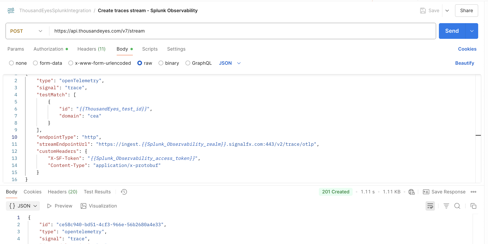
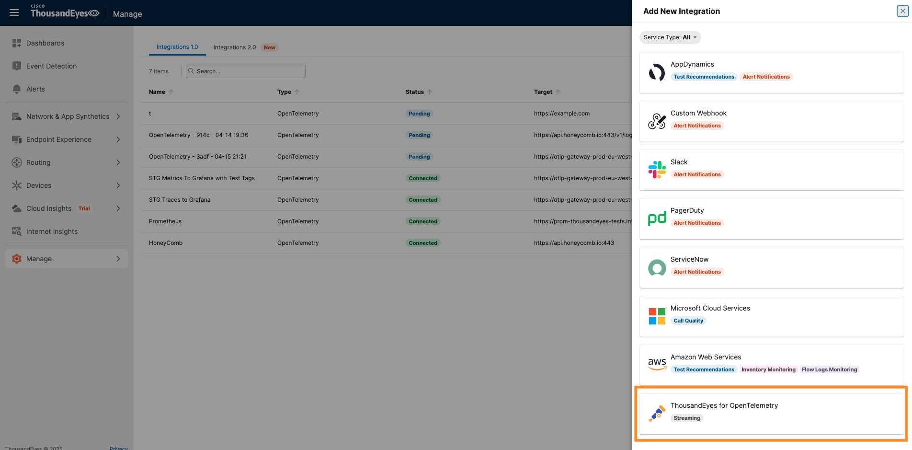
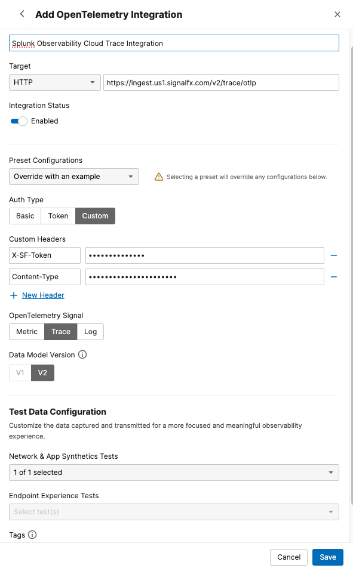

# Create Trace Streams on ThousandEyes for Splunk Observability Cloud

Choose one of the following methods to create your stream to Splunk Observability Cloud:

=== "API Method"

    Use the ThousandEyes API through Postman to create the trace stream programmatically.
    
    ### Create Trace Stream via API
    - Open the `Create traces stream - Splunk Observability` request in your Postman collection
    - Click `Send` to execute the API request
    
    

    !!! tip "API Documentation"
        For detailed API parameters and options, check the [ThousandEyes API documentation](https://developer.cisco.com/docs/thousandeyes/create-data-stream).

=== "UI Method"

    Use the ThousandEyes web interface to create the trace stream integration manually via OpenTelemetry.
    
    To integrate trace streaming from ThousandEyes to Splunk Observability Cloud, follow these steps:
    
    - Navigate to `Manage` > `Integrations` > `Integration 1.0`
    - Click `+ New Integration` and select `OpenTelemetry Integration`
    
    - Configure the integration settings:
        - Enter a `Name` for the integration (e.g., "Splunk Observability Cloud Trace Integration")
        - Set the `Target` to `HTTP`
        - Enter the `Endpoint URL` to send trace data in `OTLP (OpenTelemetry Protocol)` format:
          ```
          https://ingest.<REALM>.signalfx.com/v2/trace/otlp
          ```
            - Replace `<REALM>` with your Splunk environment such as `us1`, `eu0`, `us0`
        - For `Preset Configuration`, select `Splunk Observability Cloud`
        - For `Auth Type`, select `Custom`
        - Set the following `Custom Headers`:
            - `X-SF-Token: {TOKEN}`
                - Enter your Splunk Observability Cloud access token
            - `Content-Type: application/x-protobuf`
        - Select `Trace` as the OpenTelemetry `Signal`
        - Select `v2` as the `Data Model Version`
        - For `Network & App Synthetic`, select a the test that you want to stream data from
    - Click `Save`

    


!!! note "Receiving trace data"
    The trace stream will begin sending distributed tracing data to Splunk Observability Cloud in a couple of minutes. You can view these traces in the APM section of Splunk Observability Cloud.
