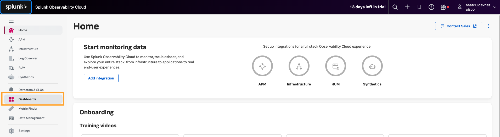
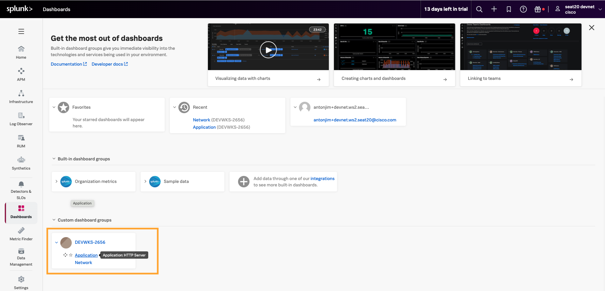

# Visualize ThousandEyes Metrics in Splunk Observability Cloud

## Import dashboard

To get started quickly with ThousandEyes data visualization, you can import pre-built dashboards that are included in this session.

- Download [dashboard file](https://github.com/antonjim-te/thousandeyes-splunk-integrations-workshop/blob/main/dashboards/dashboard_Splunk_Observability_Cloud.json)

!!! note "If you're using a shared Splunk Observability Cloud instance"
    Use a unique dashboard group name to avoid creating duplicate dashboards.
    
    Instead of `"name": "ThousandEyes Dashboard",` use `"name": "ThousandEyes Dashboard by <your_userId>",`

- Log in to your `Splunk Observability Cloud` instance
- Navigate to `+` from the main menu
- Click `Import` from the dropdown options and select `Dashboard group`
- Select the `dashboard_Splunk_Observability_Cloud.json` file from your local system

## Visualize the dashboard

- In the initial page of Splunk Observability Cloud
- Navigate to `Dashboards`

- In `Custom dashboard groups`, expand `ThousandEyes Dashboard` and select `Application`

- Visualize the data

!!! note "Data may not be ready - Wait a few minutes"
    The telemetry needs to be generated by the application and send to Splunk. This may take a few minutes.

