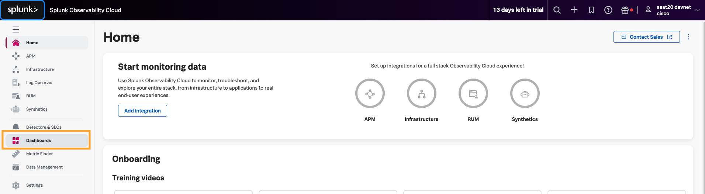
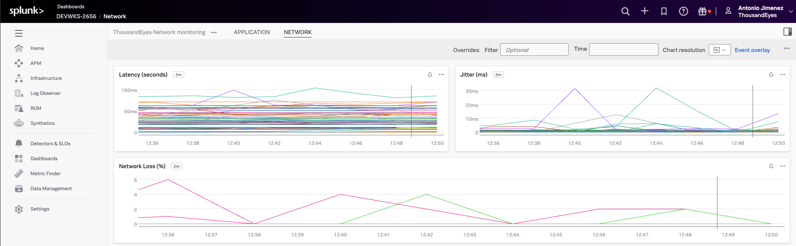

## Visualize ThousandEyes metrics in Splunk Observability Cloud
### Import dashboard

To get started quickly with ThousandEyes data visualization, you can import pre-built dashboards that are included in this workshop.

- Locate dashboard file: `dashboards/dashboard_Splunk_Observability_Cloud.json`
- Log into your [Splunk Observability Cloud](https://app.us1.signalfx.com/) instance
- Navigate to `+` from the main menu
- Click `Import` from the dropdown options and select `Dashboard group`
- Select the `dashboard_Splunk_Observability_Cloud.json` file from your local system

### Visualize the dashbaord

- In the initial page of Splunk Observability Cloud
- Navigate to `Dashboards`

- In `Custom dashboard groups`, expand `ThousandEyes Dashboard` and select `Application`

- Visualize the data

