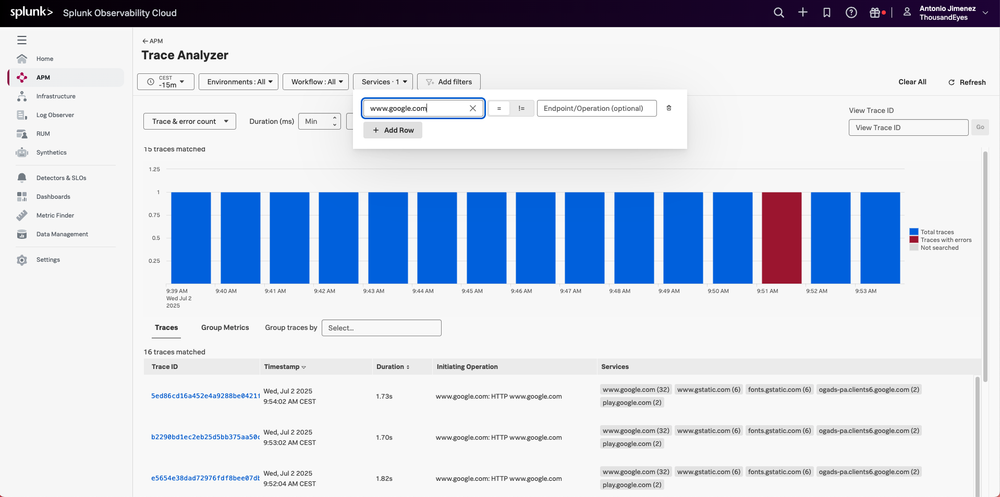
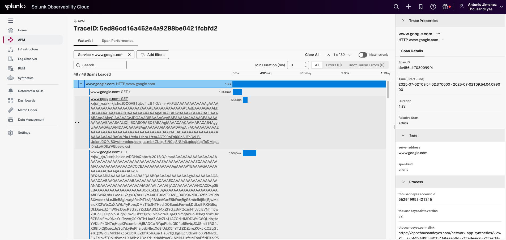
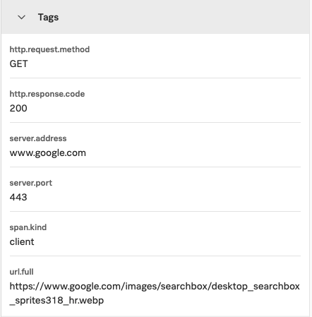

# Visualize ThousandEyes Page Load HAR as a trace in Splunk Observability Cloud 

- In the initial page of Splunk Observability Cloud
- Navigate to `APM` -> `Traces`
- Filter by `Services` and select `www.google.com`

- Click on a trace to view details

- Each span will be a step in the page load
- Each span will contains:
    - Information about the request: URL, method, duration, and status code
        - 
    - ThousandEyes identification: account, test, agent, stream
        - 