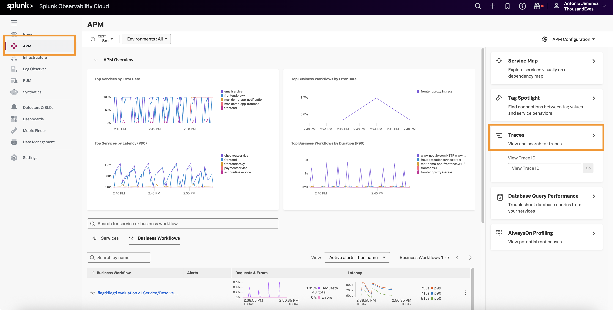
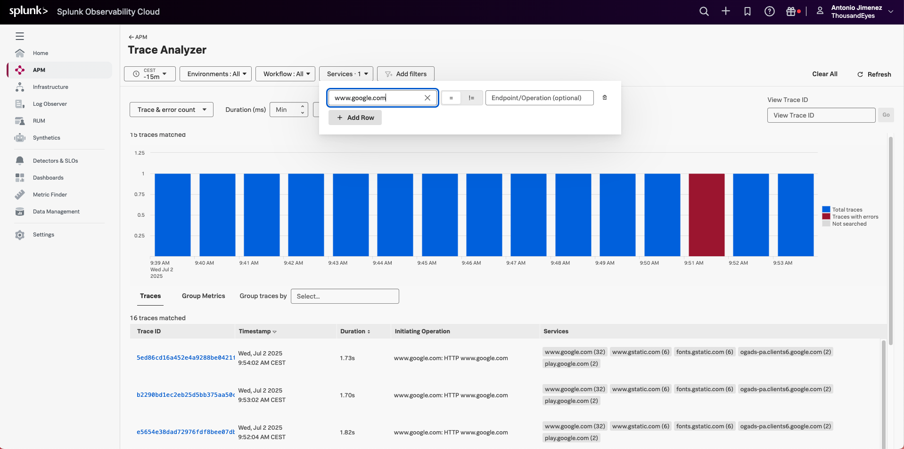
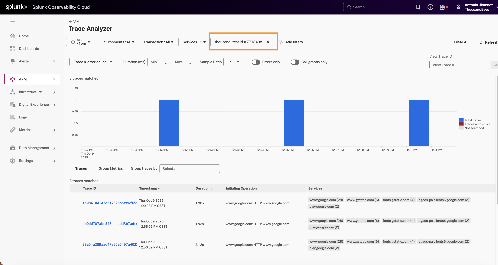
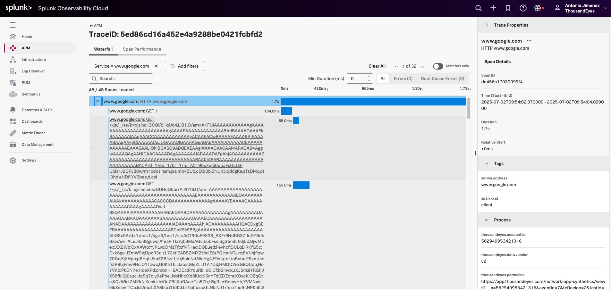
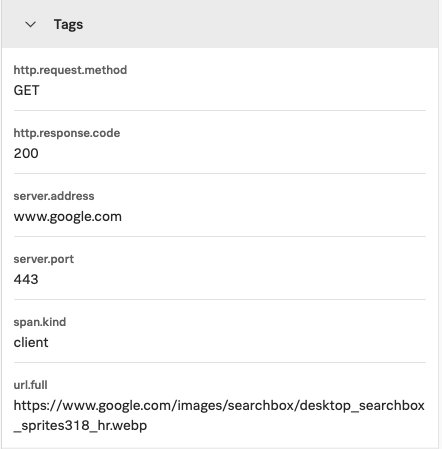
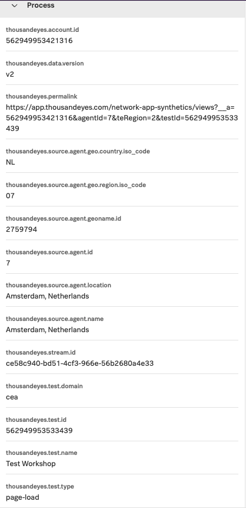
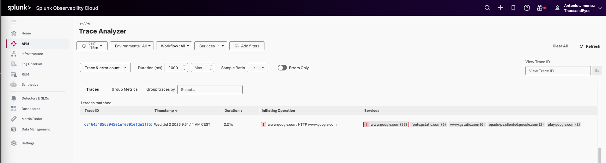
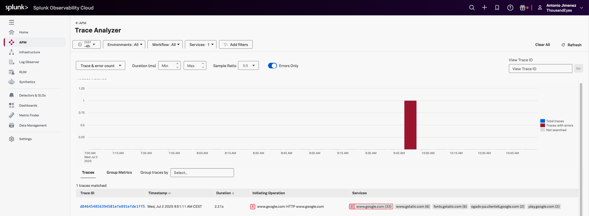

# Visualize ThousandEyes Page Load HAR as a trace in Splunk Observability Cloud 

- In the initial page of Splunk Observability Cloud
- Navigate to `APM` -> `Traces`

- Filter by `Services` and select `www.google.com`

!!! note "Data may not be ready - Wait a few minutes"
    The telemetry needs to be generated by the application and send to Splunk. This may take a few minutes.

- You can also filter by other attributes like `thousandeyes.test.id`

- Click on a trace to view details

- Each span will be a step in the page load
- Each span will contains:
    - Information about the request: URL, method, duration, and status code
        - 
    - ThousandEyes identification: account, test, agent, stream
        - 

## Now you can use the Observability backend feature

### Search for traces with a specific duration

- In the search bar, use the following query to find traces with a duration greater than 2000ms:

### Search for traces with errors

- In the search bar, select the `Error Only` checkbox to filter traces with errors

