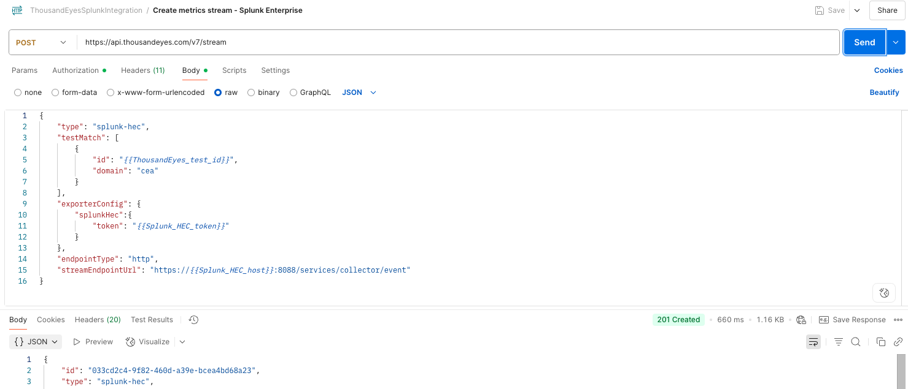
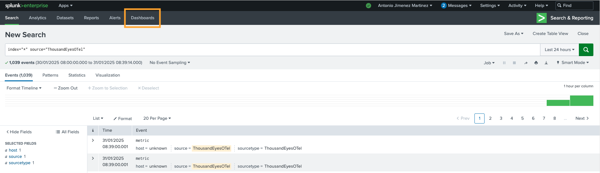
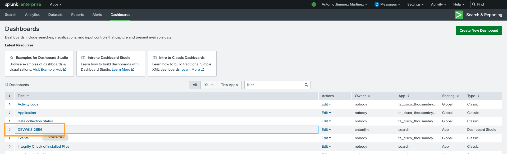
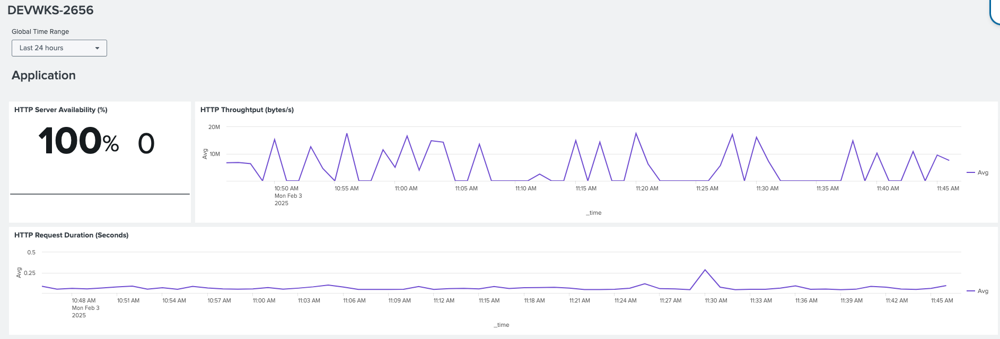
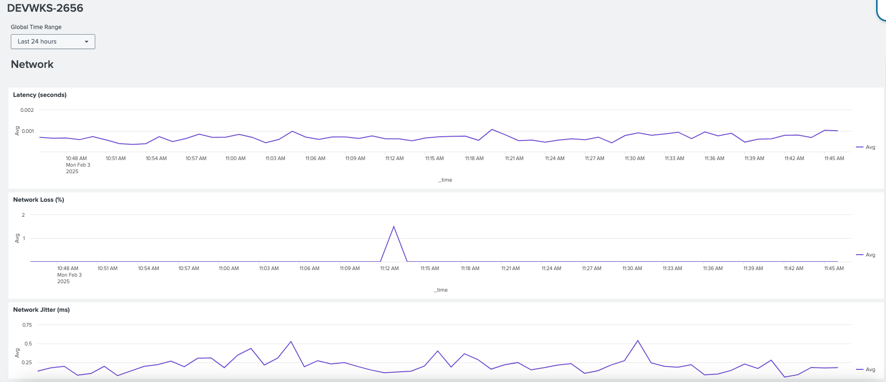

# Step 4. Stream to Splunk Enterprise

## Step 4.a. Create Streaming integration on ThousandEyes for Splunk Enterprise

- Create a stream integration for Splunk Enterprise. Check the [ThousandEyes API documentation](https://developer.cisco.com/docs/thousandeyes/create-data-stream).
- Use `Create Streaming Integration - Splunk Enterprise` Postman request to create the stream

## Step 4.b. Access Splunk Enterprise

- Navigate to [Splunk Enterprise](https://splunk.pseudoco.net)
    - Username: `antonjim+devnet<seat>@cisco.com`  (e.g. `antonjim+devnet1@cisco.com`)
    - Password: ``

## Step 4.c. Visualize ThousandEyes telemetry data in Splunk Enterprise

- In the initial page of [Splunk Enterprise](https://splunk.pseudoco.net)
- Navigate to `Search & Reporting`

- Navigate to `Dashboards`

- Select `DEVWKS-2656`

- Visualize the data

