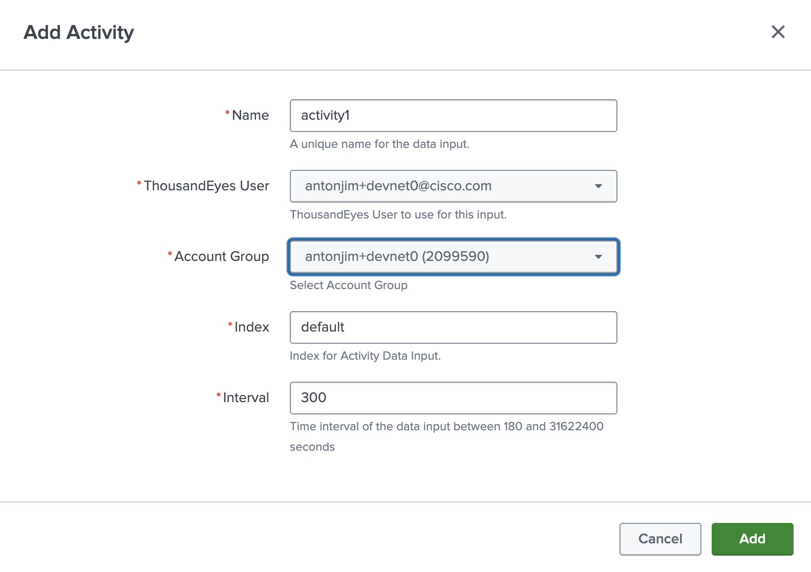
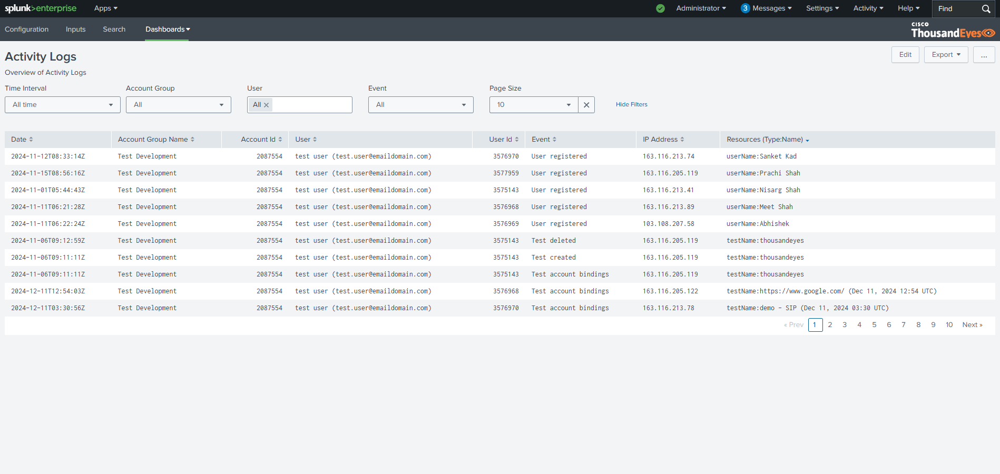

## Create activity log input

- In `inputs` section
- Click `Create New Input`, select `Activity`
- Fill the form:
    - Name: unique name
    - ThousandEyes User: select you user
    - Account Group: select your account
    - Index: select `default`

## Activity logs dashboards

- In the `dashboards` section, select `Activity Logs` 

