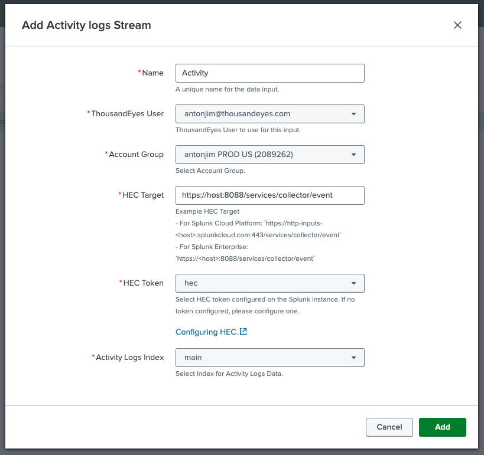
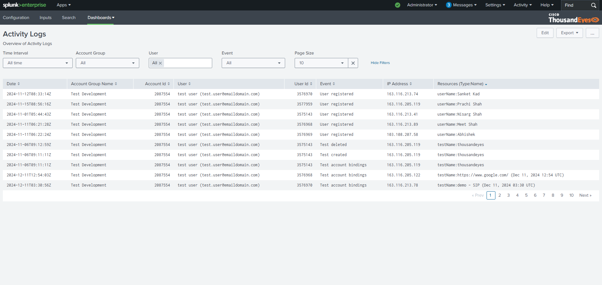

## Create an Activity Log Input

- In `inputs` section
- Click `Create New Input`, select `Activity logs Stream`
- Fill the form:
    - Name: unique name
    - ThousandEyes User: select you user
    - Account Group: select your account
    - HEC Target: The HEC target of your Splunk instance. Example HEC Target:
        - For Splunk Cloud Platform: `https://http-inputs-<host>.splunkcloud.com:443/services/collector/event`
        - For Splunk Enterprise: `https://<host>:8088/services/collector/event`
    - HEC Token: select `ThousandEyesToken`
    - Activity logs Index: select `default`

## Activity Log Dashboards

- Generate some activity logs in ThousandEyes by creating/deleting tests.
- In the `dashboards` section, select `Activity Log` 

!!! note "Data may not be ready - Wait a few minutes"
    The telemetry needs to be generated by the application and send to Splunk. This may take a few minutes.

- Once you see data, you can filter by account group, user, event and time interval.