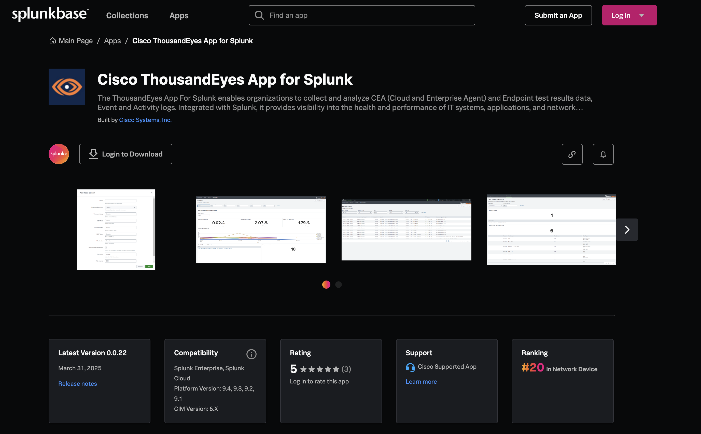
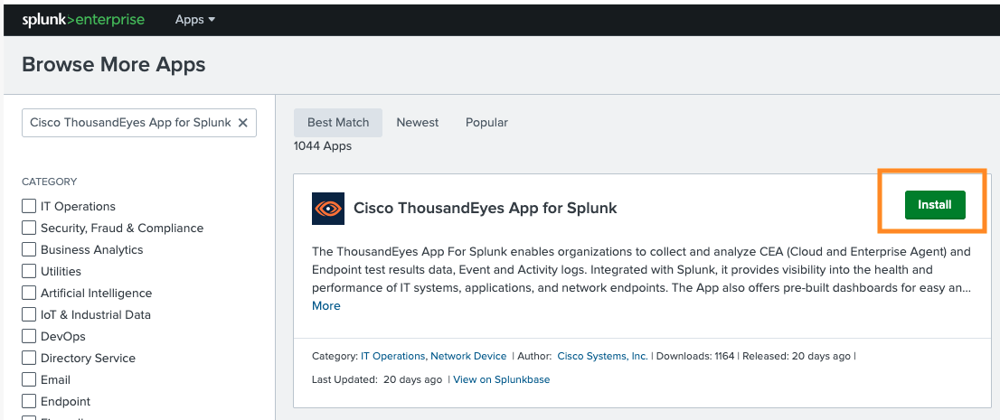
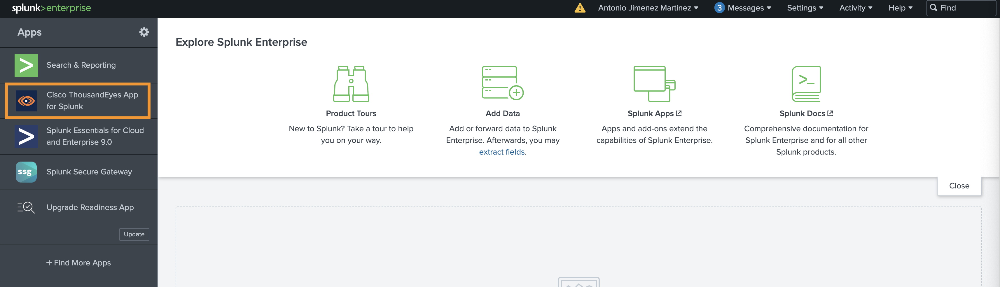
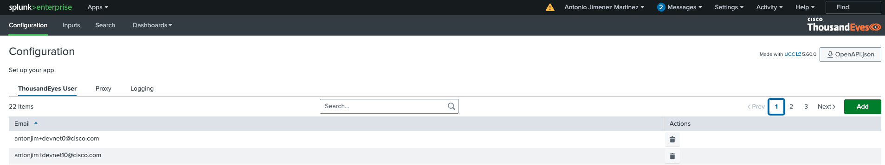
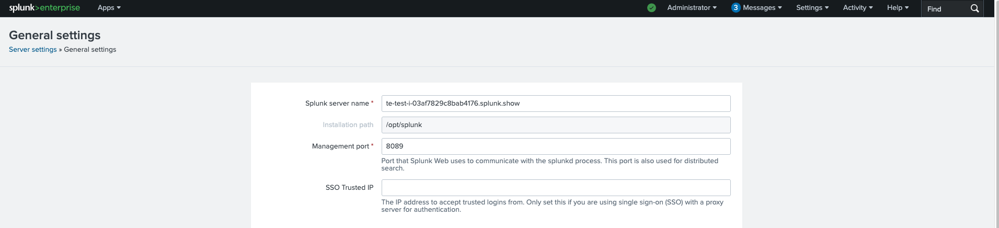

# Cisco ThousandEyes App for Splunk

The [Cisco ThousandEyes App for Splunk](https://splunkbase.splunk.com/app/7719) enables collecting and analyzing:

- Cloud and Enterprise Agent and Endpoint test results data
- Event
- Activity Log

!!! tip "Docs"
    You can find documentation [here](https://docs.thousandeyes.com/product-documentation/integration-guides/custom-built-integrations/splunk-app).

## Install Cisco ThousandEyes App for Splunk

- Once we are logged into Splunk Enterprise 
- Navigate to `Apps` > `Find More Apps`
- Search for `Cisco ThousandEyes App for Splunk` 
- Click on `Install`
    - Login `splunk.com`

## Access Cisco ThousandEyes App for Splunk

- Navigate to `Cisco ThousandEyes App for Splunk`

- In the app, you will find out: `configuration`, `inputs`, `search` and `dashboards`.

## Configuring Server name

- Go to `Setttings` > `Server Settings` -> `General Settings` > `Server Name`
- Set the `Server Name` to the hostname of your Splunk instance. Same value that the Bruno variable `splunk_hec_host` is set to.

- Save the changes.
- Restart the Splunk instance.
  - Go to `Server Controls` > `Restart Splunk`    