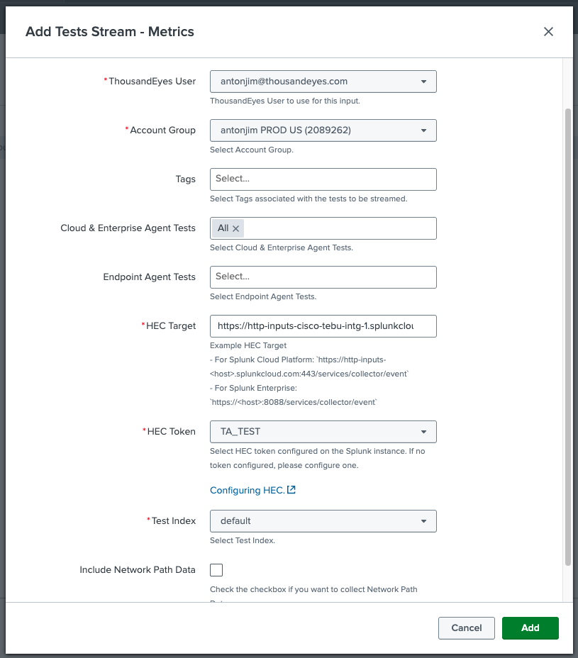
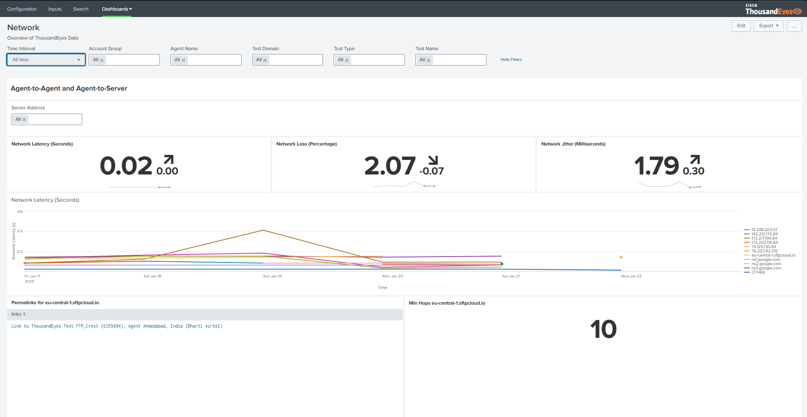
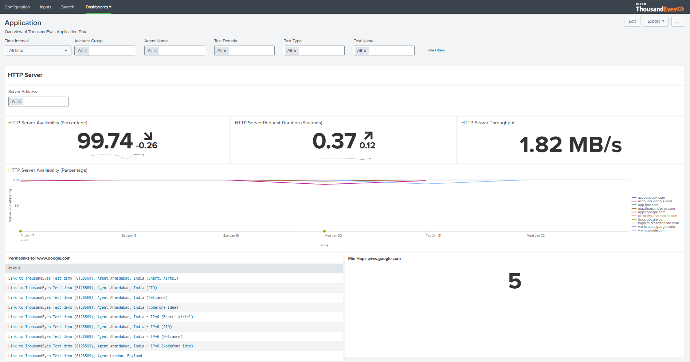

## Create a Test Stream - Metrics Input

- In `inputs` section
- Click `Create New Input`, select `Test Stream - Metrics`
- Fill the form:
    - Name: unique name
    - ThousandEyes User: select you user
    - Account Group: select your account
    - HEC Target: The HEC target of your Splunk instance. Example HEC Target:
        - For Splunk Cloud Platform: `https://http-inputs-<host>.splunkcloud.com:443/services/collector/event`
        - For Splunk Enterprise: `https://<host>:8088/services/collector/event`
    - Cloud & Enterprise Agent Tests: select your HTTP test
    - HEC Token: select `ThousandEyesToken`
    - Test Index: select `default`

## Network and Application dashboards

- In the `dashboards` section, select `Network` 

- In the `dashboards` section, select `Application`

!!! note "Data may not be ready - Wait a few minutes"
    The telemetry needs to be generated by the application and send to Splunk. This may take a few minutes.

- Filter the data by account group, agent name, test type, test name and time interval.
