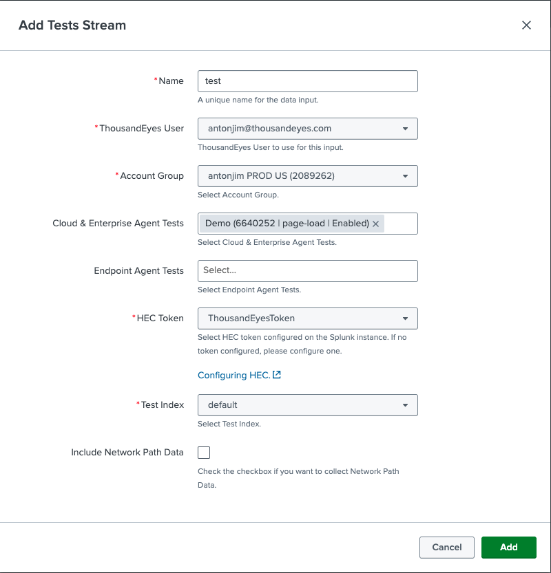
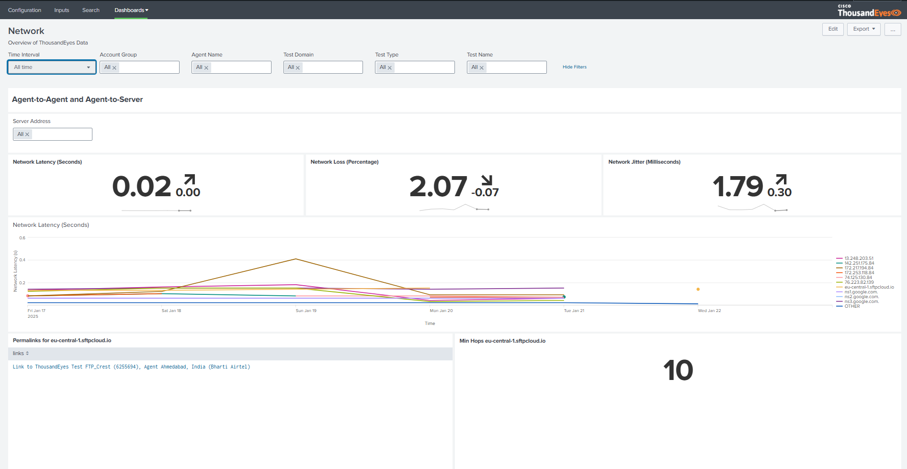
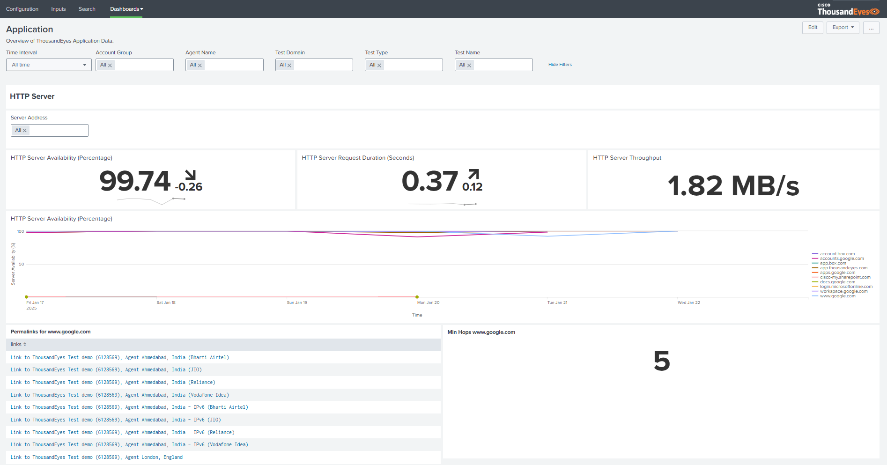

## Create stream test input

- In `inputs` section
- Click `Create New Input`, select `Tests Stream`
- Fill the form:
    - Name: unique name
    - ThousandEyes User: select you user
    - Account Group: select your account
    - Cloud & Enterprise Agent Tests: select your HTTP test
    - HEC Token: select `ThousandEyesToken`
    - Test Index: select `default`



## Network and Application dashboards

- In the `dashboards` section, select `Network` 

- In the `dashboards` section, select `Application`



## Troubleshooting

Issue 
```
Error while configuring ThousandEyes stream input.Error: The Server Name, Host Name and Host is not reachable from Cisco Thousandeyes. One of these needs to be configured so that it is reachable from Cisco Thousandeyes. Server Name: show-s4x-config-i-03af7829c8bab4176, Host Name: show-s4x-config-i-03af7829c8bab4176, Host : 127.0.0.1. Please check the logs.
```

Solution: [Configuring Server name](getting_started.md#configuring-server-name)
