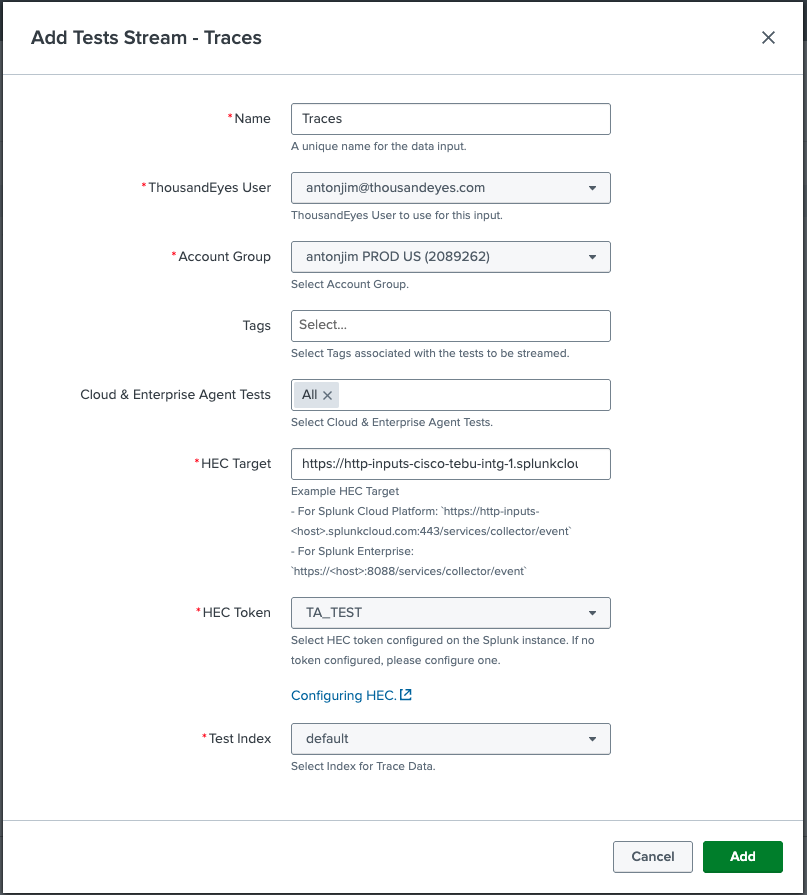
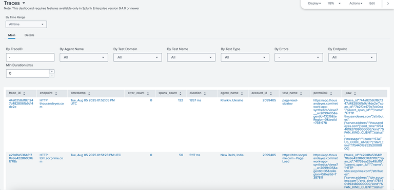
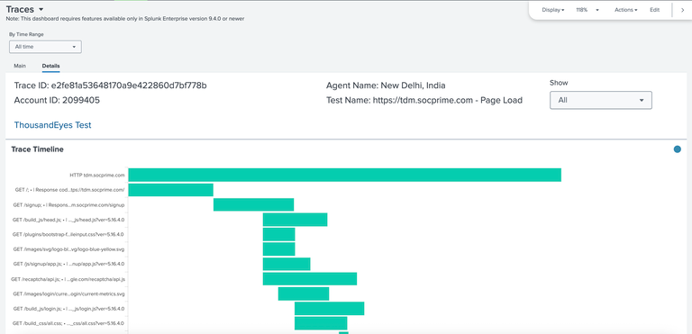
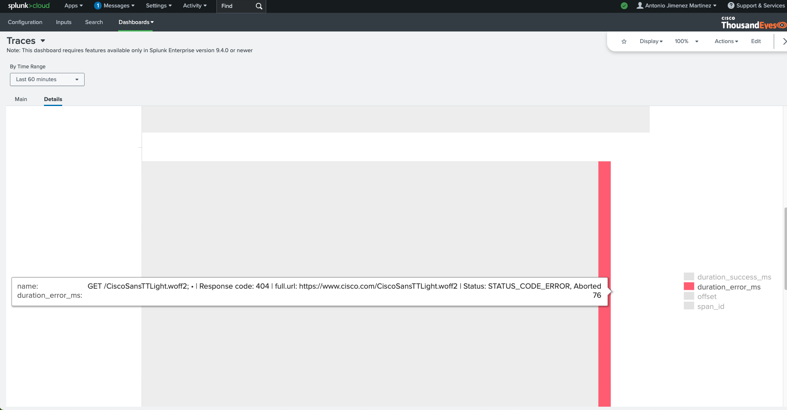

## Create a Test Stream - Traces Input

- In `inputs` section
- Click `Create New Input`, select `Test Stream - Traces`
- Fill the form:
    - Name: unique name
    - ThousandEyes User: select your user
    - Account Group: select your account group
    - HEC Target: HEC endpoint for your Splunk instance. Examples:
        - For Splunk Cloud Platform: `https://http-inputs-<host>.splunkcloud.com:443/services/collector/event`
        - For Splunk Enterprise: `https://<host>:8088/services/collector/event`
    - Cloud & Enterprise Agent Tests: select your HTTP test
    - HEC Token: select `ThousandEyesToken`
    - Test Index: select `default`

## Traces dashboards

!!! warning "Version limitation"
    This dashboard requires features available only in Splunk Enterprise/Splunk Cloud version 9.4.0 or newer

!!! note "Data may not be ready - Wait a few minutes"
    The telemetry needs to be generated by the application and send to Splunk. This may take a few minutes.

- In the `dashboards` section, select `Traces`

    - `Main`: See the list of traces:

        

        - Filter traces by fields such as ThousandEyes agent, ThousandEyes test name, endpoint, error status and time interval.
        - Select a `trace_id` to explore.

    - `Details`: Explore a trace:

        
        
        - You can filter only the spans that contain errors.
        - To see more about a span, hover it to view the method, URL, response code, and status.
        
            
