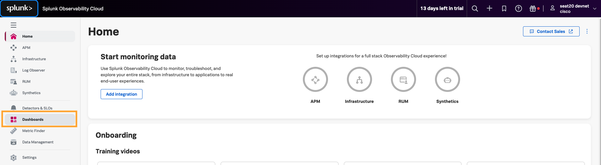

# visualize ThousandEyes data in Splunk Observability Cloud

## Access Splunk Observability Cloud

- Navigate to [Splunk Observability Cloud](https://app.us1.signalfx.com/#/signin) 
    - Email: `antonjim+devnet<seat>@cisco.com` 
        - (e.g. `antonjim+devnet1@cisco.com`)
    - Password: ``

## Visualize ThousandEyes telemetry data in Splunk Observability Cloud

- In the initial page of [Splunk Observability Cloud](https://app.us1.signalfx.com/)
- Navigate to `Dashboards`

- In `Custom dashboard groups`, expand `DEVWKS-2656` and select `Application`

- Visualize the data

