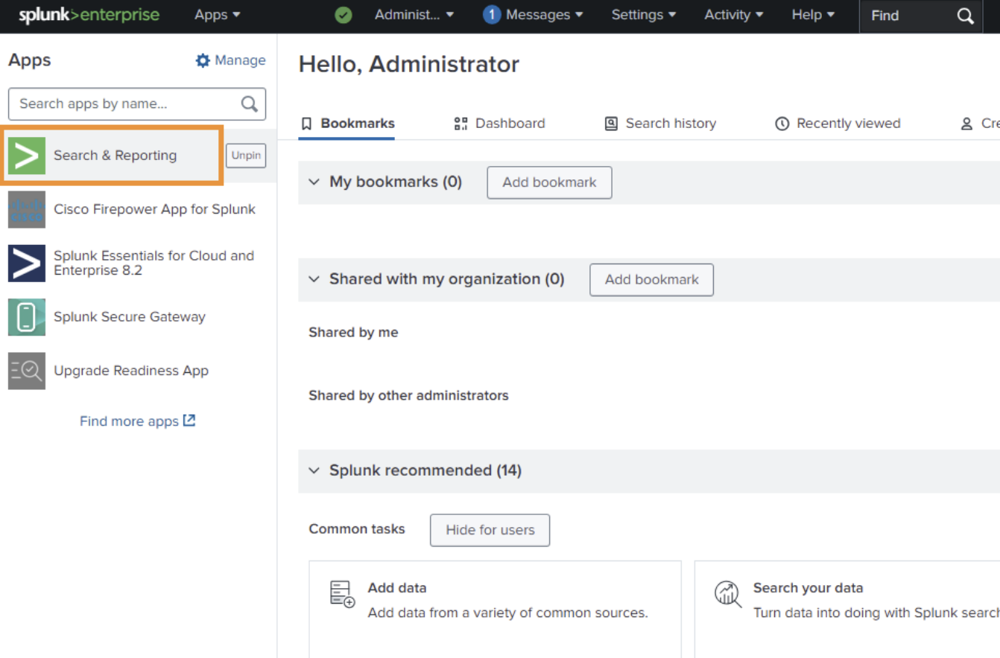

## Visualize ThousandEyes telemetry data in Splunk Enterprise

## Visualize ThousandEyes metrics in Splunk Observability Cloud

### Import dashboard

To get started quickly with ThousandEyes data visualization, you can import pre-built dashboards that are included in this workshop.

- Locate Dashboard Files
    - Navigate to the `dashboards` folder in your workshop repository
    - Find the dashboard file: `dashboard_Splunk_Observability_Cloud.json`
- Log into your [Splunk Observability Cloud](https://app.us1.signalfx.com/) instance
- Navigate to `+` from the main menu
- Click `Import` from the dropdown options and select `Dashboard group`
- Select the `dashboard_Splunk_Observability_Cloud.json` file from your local system

### Visualize the dashbaord

- In the initial page of [Splunk Enterprise](https://splunk.pseudoco.net)
- Navigate to `Search & Reporting`

- Navigate to `Dashboards`

- Select `DEVWKS-2656`

- Visualize the data

