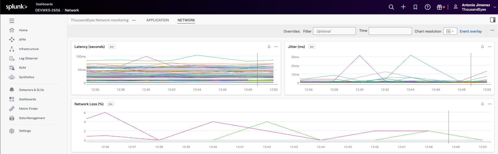

# Visualize ThousandEyes data in Splunk Cloud Platform or Splunk Enterprise

## Visualize ThousandEyes metrics in Splunk Cloud Platform or Splunk Enterprise

### Import dashboard

To get started quickly with ThousandEyes data visualization in Splunk, you can import pre-built dashboards that are included in this workshop.

#### Locate Dashboard Files
- Navigate to the `dashboards` folder in your workshop repository
- Find the dashboard file: `dashboard_Splunk_Core.json`

#### Import Dashboard to Splunk

=== "Splunk Cloud Platform"
    
    - Navigate to `Apps > Search & Reporting`
    - Click `Dashboards` in the navigation menu
    - Click `Create New Dashboard`
    - Select `Dashboard Studio` for modern dashboard features
    - Choose `Import from file` option
    - Upload the `dashboard_Splunk_Core.json` file
    - Configure dashboard settings:
        - `Title`: "ThousandEyes Network Monitoring"
        - `Description`: "Monitor ThousandEyes test results and network performance"
        - `Permissions`: Set appropriate sharing permissions

=== "Splunk Enterprise"

    Method 1: Simple XML Dashboard
    
    - Log into your Splunk Enterprise web interface
    - Navigate to `Settings > User Interface > Views`
    - Click `New View`
    - Enter dashboard details:
        - `Destination App`: Choose target app (e.g., "Search & Reporting")
        - `View Name`: "thousandeyes_network_monitoring"
        - `View Title`: "ThousandEyes Network Monitoring"
    - Select `Dashboard` as view type
    - Copy the XML content from the JSON file into the dashboard source
    - Click `Save`
    
    Method 2: Upload via Apps
    
    - Go to `Apps > Manage Apps`
    - Find your target app (e.g., "Search & Reporting")
    - Navigate to the app's dashboard directory on the Splunk server
    - Copy the dashboard file to: `$SPLUNK_HOME/etc/apps/[app_name]/local/data/ui/views/`
    - Restart Splunk or refresh your browser to see the new dashboard

### Visualize the dashbaord

- In the initial page of Splunk Observability Cloud
- Navigate to `Dashboards`

- In `Custom dashboard groups`, expand `ThousandEyes Dashboard` and select `Application`

- Visualize the data

