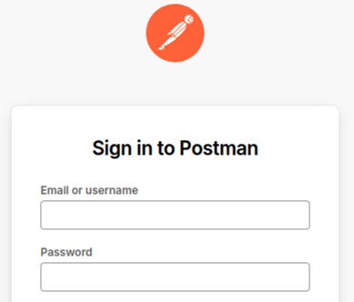
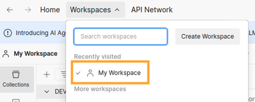
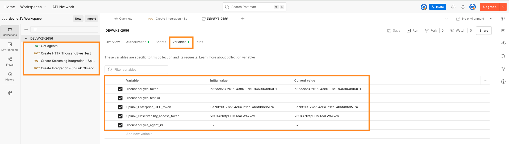

# Step 1. Access Postman

- Navigate to [Postman](https://identity.getpostman.com/login)
-  Sign in 
    - Email: `antonjim+devnet<seat>@cisco.com` (e.g. `antonjim+devnet1@cisco.com`)
    - Password: `Cisco.25`

- Navigate to `Workspaces` -> `devnet's Workspace`

- Verify the collection `DEVWKS-2656` is loaded, including requests and variables.

